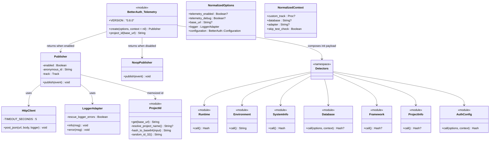

# Design Document

## Overview

This design ports the upstream `@better-auth/telemetry` package
(`upstream/better-auth/1.6.9/packages/telemetry/`) into this Ruby monorepo as a
canonical/alias gem pair (`better_auth-telemetry` + `openauth-telemetry`)
following the pattern set by `better_auth-stripe` / `openauth-stripe`.

The port is **not** a 1:1 source translation. The upstream package ships two
build entrypoints (`src/index.ts` for browser/edge and `src/node.ts` for Node)
because it must run in heterogeneous JavaScript runtimes. This Ruby port
collapses both upstream variants into a single server-side Ruby implementation
with no runtime branching for Node/Bun/Deno. Detectors are reimplemented using
idiomatic Ruby (`RUBY_VERSION`, `RUBY_ENGINE`, `RbConfig`, `Etc`,
`Gem.loaded_specs`, `Bundler`, `BetterAuth::Configuration`).

The key wire-level guarantees of upstream are preserved:
- The init event payload uses upstream **camelCase** keys so existing
  ingest/consumer code does not need a Ruby-specific schema branch.
- The auth-config detector applies the same boolean redaction rules as
  upstream `getTelemetryAuthConfig`.
- `customTrack` is preserved as the testing seam (no HTTP mocking).
- Telemetry is opt-in only and skipped under `RACK_ENV=test` /
  `RAILS_ENV=test` / `APP_ENV=test` unless `skip_test_check` bypasses the
  test gate.

### Goals

1. Ship a canonical `better_auth-telemetry` gem and an alias
   `openauth-telemetry` gem that mirrors the canonical/alias contract used by
   every other Better Auth Ruby plugin pair.
2. Match upstream wire format (init event keys, redaction rules,
   `anonymousId` semantics, debug/noop/endpoint modes).
3. Keep telemetry strictly additive: `BetterAuth::Auth#initialize` works
   unchanged when the telemetry gem is not installed.
4. Use only Ruby's standard library (`Net::HTTP`, `URI`, `JSON`,
   `Digest::SHA256`, `Base64`, `SecureRandom`) for HTTP and crypto. No
   external HTTP-client gem.
5. Resolve every telemetry env var through `BetterAuth::Env.get` so both
   `BETTER_AUTH_*` and `OPEN_AUTH_*` prefixes are honored.
6. Guarantee that telemetry never raises out of `#publish` or
   `BetterAuth::Auth#initialize`: every external boundary
   (HTTP, custom_track, logger, detector probe) is wrapped in
   `rescue StandardError`.
7. Ship a property-based test suite using `prop_check` when available,
   falling back to deterministic Minitest cases otherwise.

### Non-goals

- **No Node-runtime parity.** No Deno/Bun/edge probes, no
  `npm_config_user_agent` parsing, no `node_modules` package.json walks.
- **No new env-var names.** Only the three documented upstream variables
  (`BETTER_AUTH_TELEMETRY`, `BETTER_AUTH_TELEMETRY_DEBUG`,
  `BETTER_AUTH_TELEMETRY_ENDPOINT`).
- **No upstream-tree edits.** `upstream/better-auth/1.6.9/` (including its
  `.github/workflows/release.yml`) stays read-only reference material.
- **No public ingest endpoint operated by this repo.** This port produces a
  publisher; the receiving side is out of scope.
- **No background thread / async dispatch.** The publisher posts
  synchronously inside a bounded 5s timeout. Async delivery can be a future
  enhancement and is intentionally deferred.
- **No SDK API change to existing core.** `BetterAuth::Auth#initialize`
  gains one soft-loaded hook and an `auth.telemetry` reader; nothing else
  changes.

## Architecture

### Package layout

```text
packages/
  better_auth-telemetry/
    better_auth-telemetry.gemspec
    README.md
    CHANGELOG.md
    LICENSE.md
    lib/
      better_auth/
        telemetry.rb                       # public surface, requires submodules
        telemetry/
          version.rb                       # BetterAuth::Telemetry::VERSION = "0.8.0"
          create.rb                        # BetterAuth::Telemetry.create(options, context)
          publisher.rb                     # BetterAuth::Telemetry::Publisher
          project_id.rb                    # BetterAuth::Telemetry.project_id
          options.rb                       # NormalizedOptions/NormalizedContext value objects
          http_client.rb                   # Net::HTTP delivery with timeout + rescue
          logger_adapter.rb                # logger fallback / rescue
          noop_publisher.rb                # disabled path
          detectors.rb                     # autoloads detectors
          detectors/
            runtime.rb
            environment.rb
            system_info.rb
            database.rb
            framework.rb
            project_info.rb
            auth_config.rb
        plugins/
          telemetry.rb                     # soft-load shim consumed by better_auth.rb
    test/
      test_helper.rb
      telemetry/
        create_test.rb
        publisher_test.rb
        project_id_test.rb
        http_client_test.rb
        detectors/
          runtime_test.rb
          environment_test.rb
          system_info_test.rb
          database_test.rb
          framework_test.rb
          project_info_test.rb
          auth_config_test.rb
        properties/
          json_round_trip_test.rb
          redaction_test.rb
          project_id_idempotence_test.rb
          environment_classifier_test.rb
        support/
          recording_track.rb               # custom_track recorder
          local_endpoint_server.rb         # TCPServer-backed test endpoint

packages/
  openauth-telemetry/
    openauth-telemetry.gemspec             # spec.version = "0.8.0", literal pin
    README.md
    CHANGELOG.md
    lib/
      openauth/
        telemetry.rb                       # require "openauth"; require "better_auth/telemetry"
                                           # OpenAuth::Telemetry = BetterAuth::Telemetry
                                           # OpenAuth.alias_better_auth_constants!
```

### Module / class layout



### Request flow: `BetterAuth::Telemetry.create` → publisher → publish

```mermaid
sequenceDiagram
  autonumber
  participant Caller as BetterAuth::Auth#initialize
  participant Create as BetterAuth::Telemetry.create
  participant Opts as NormalizedOptions/Context
  participant Detect as Detectors (parallel calls)
  participant Pid as Telemetry.project_id
  participant Pub as Publisher
  participant Track as track lambda
  participant Sink as HTTP / custom_track / noop
  participant Logger as LoggerAdapter

  Caller->>Create: create(options, context)
  Create->>Opts: normalize(options, context)
  Opts-->>Create: norm
  Create->>Create: endpoint = Env.get("BETTER_AUTH_TELEMETRY_ENDPOINT")
  alt no endpoint AND no custom_track
    Create-->>Caller: NoopPublisher
  else
    Create->>Create: enabled? (opt-in AND not test OR skip_test_check)
    alt disabled
      Create-->>Caller: Publisher(enabled=false) (publish is noop)
    else enabled
      Create->>Pid: project_id(base_url)
      Pid-->>Create: anonymous_id (memoized)
      par
        Create->>Detect: AuthConfig.call(options, context)
      and
        Create->>Detect: Runtime.call
      and
        Create->>Detect: SystemInfo.call
      and
        Create->>Detect: Database.call(options, context)
      and
        Create->>Detect: Framework.call
      and
        Create->>Detect: Environment.call
      and
        Create->>Detect: ProjectInfo.call
      end
      Detect-->>Create: payload
      Create->>Pub: new(enabled, anonymous_id, track, base_url)
      Create->>Track: track({type: "init", payload, anonymousId})
      alt custom_track present
        Track->>Sink: custom_track.call(event)
      else debug mode
        Track->>Logger: info(JSON.pretty_generate(event))
      else
        Track->>Sink: HttpClient.post_json(endpoint, event, logger)
      end
      Note over Track,Sink: rescue StandardError -> logger.error(e)
      Pub-->>Caller: Publisher
    end
  end

  Caller->>Pub: auth.telemetry.publish({type: "...", payload: {...}})
  Pub->>Pub: enabled? memoized
  alt disabled
    Pub-->>Caller: nil (noop)
  else enabled
    Pub->>Track: track({type, payload, anonymousId})
    Track->>Sink: dispatch (custom_track | debug | http)
    Note over Track,Sink: any StandardError rescued
  end
```

### Soft-load integration into `BetterAuth::Auth`

```mermaid
flowchart TD
  Init[BetterAuth::Auth#initialize] --> BuildAdapter[build_adapter / plugin_registry]
  BuildAdapter --> SoftLoad{require "better_auth/telemetry" ?}
  SoftLoad -- LoadError --> NoopAttr[set @telemetry = NoopPublisher.new]
  SoftLoad -- success --> CreateCall[BetterAuth::Telemetry.create options, telemetry_context]
  CreateCall -- StandardError --> RescueCreate[logger.error; @telemetry = NoopPublisher.new]
  CreateCall -- ok --> StorePub[@telemetry = publisher]
  NoopAttr --> Done[finish initialize]
  RescueCreate --> Done
  StorePub --> Done
  Done --> Reader[auth.telemetry reader always returns something safe to call]
```

The hook lives inside `BetterAuth::Auth#initialize`, after plugin registry
init and adapter build (so `telemetry_context[:adapter]` reflects the
final adapter class). It mirrors the soft-load shape already used in
`packages/better_auth/lib/better_auth.rb` for the `stripe` and `expo`
plugins:

```ruby
%w[
  better_auth/plugins/telemetry
].each do |optional_plugin|
  require_relative optional_plugin if File.file?(File.expand_path("#{optional_plugin}.rb", __dir__))
end
```

The `better_auth-telemetry` gem ships
`lib/better_auth/plugins/telemetry.rb` as a minimal shim that just
`require_relative`s `../telemetry`. From `Auth#initialize` we then call
`BetterAuth::Telemetry.create(...)` defensively under
`begin / rescue LoadError / rescue StandardError`.

## Components and Interfaces

### Publisher (`BetterAuth::Telemetry::Publisher`)

```ruby
module BetterAuth
  module Telemetry
    class Publisher
      # @param enabled [Boolean]
      # @param anonymous_id [String, nil]
      # @param track [#call] receives a fully-formed event hash
      # @param base_url [String, nil] used to lazily resolve anonymous_id
      def initialize(enabled:, anonymous_id:, track:, base_url:, logger:)
        @enabled = enabled
        @anonymous_id = anonymous_id
        @track = track
        @base_url = base_url
        @logger = logger
      end

      # @param event [Hash] { type: String, payload: Hash }
      # @return [void]
      def publish(event)
        return unless @enabled

        @anonymous_id ||= BetterAuth::Telemetry.project_id(@base_url)
        @track.call(
          type: event[:type] || event["type"],
          payload: event[:payload] || event["payload"] || {},
          anonymousId: @anonymous_id
        )
      rescue StandardError => e
        @logger.error("[better-auth.telemetry] publish failed: #{e.class}: #{e.message}")
        nil
      end

      def enabled?
        @enabled
      end
    end
  end
end
```

The `track` callable is built once inside `create` and closes over
`custom_track` / `debug` / `endpoint` so `Publisher` itself stays
delivery-agnostic.

### NoopPublisher (`BetterAuth::Telemetry::NoopPublisher`)

```ruby
module BetterAuth
  module Telemetry
    class NoopPublisher
      def publish(_event) = nil
      def enabled? = false
    end
  end
end
```

Both `BetterAuth::Telemetry.create` (when disabled or no endpoint and no
custom_track) and the soft-load fallback in `BetterAuth::Auth` use this
class so callers never need to nil-check `auth.telemetry`.

### `BetterAuth::Telemetry.create`

Single module method that:

1. Builds `NormalizedOptions` and `NormalizedContext` value objects so the
   rest of the pipeline does not have to repeatedly do hash key lookups
   that accept both snake_case and camelCase.
2. Resolves `endpoint = BetterAuth::Env.get("BETTER_AUTH_TELEMETRY_ENDPOINT")`.
3. Returns `NoopPublisher.new` immediately if endpoint absent and
   `custom_track` absent (matches upstream `if (!telemetryEndpoint &&
   !context?.customTrack) return { publish: noop }`).
4. Computes `enabled = opt_in? && (skip_test_check? || !test_environment?)`
   with the option > env precedence rule
   (`options.telemetry.enabled == false` overrides env opt-in).
5. If enabled, computes `anonymous_id` via `project_id(base_url)` and
   builds the init payload by calling each detector. Each detector call is
   wrapped in `rescue StandardError` at the detector layer, so partial
   failure degrades to `nil` for that field rather than aborting the
   whole event.
6. Builds `track` lambda that branches on `custom_track? / debug? /
   endpoint?` (in that order).
7. Synchronously calls `track` with the init event (matches upstream
   `void track(...)` semantics — fire and forget but in our case still
   bounded by the 5s HTTP timeout).
8. Returns a `Publisher` whose subsequent `#publish` calls reuse the same
   `track`, `anonymous_id`, and `enabled` flag.

### `BetterAuth::Telemetry::ProjectId` / `BetterAuth::Telemetry.project_id`

Memoized module method. The cache lives in `@@project_id_cache` on the
module so concurrent threads see the same value.

```ruby
module BetterAuth
  module Telemetry
    @project_id_cache = nil
    @project_id_mutex = Mutex.new

    def self.project_id(base_url)
      return @project_id_cache if @project_id_cache

      @project_id_mutex.synchronize do
        return @project_id_cache if @project_id_cache

        name = ProjectId.resolve_project_name
        @project_id_cache =
          if name && !name.empty?
            base = (base_url.is_a?(String) && !base_url.empty?) ? "#{base_url}#{name}" : name
            hash_to_base64(base)
          elsif base_url.is_a?(String) && !base_url.empty?
            hash_to_base64(base_url)
          else
            random_id_32
          end
      end
    end

    def self.hash_to_base64(input)
      Base64.strict_encode64(Digest::SHA256.digest(input.to_s))
    end

    def self.random_id_32
      # alphanumeric a-zA-Z0-9, length 32, mirrors upstream generateId(32)
      alphabet = ("a".."z").to_a + ("A".."Z").to_a + ("0".."9").to_a
      Array.new(32) { alphabet[SecureRandom.random_number(alphabet.length)] }.join
    end

    module ProjectId
      DEFAULT_APP_NAME = "Better Auth"

      def self.resolve_project_name
        from_app_name || from_locked_gems || from_bundler_root
      rescue StandardError
        nil
      end

      def self.from_app_name
        return nil unless defined?(BetterAuth::Telemetry::CurrentOptions)
        # set during create(); falls back to nil when not in a create flow
        name = BetterAuth::Telemetry::CurrentOptions.app_name
        return nil if name.nil? || name == DEFAULT_APP_NAME
        name
      end

      def self.from_locked_gems
        return nil unless defined?(::Bundler)
        ::Bundler.locked_gems&.specs&.first&.name
      rescue StandardError
        nil
      end

      def self.from_bundler_root
        return nil unless defined?(::Bundler)
        File.basename(::Bundler.root.to_s)
      rescue StandardError
        nil
      end
    end
  end
end
```

`CurrentOptions` is a tiny thread-local-backed registry set at the start of
`BetterAuth::Telemetry.create` so `ProjectId.resolve_project_name` can reach
the app name without changing the public method signature
(`project_id(base_url)`) the upstream and Requirement 14.1 specify.

### Runtime detector

```ruby
module BetterAuth::Telemetry::Detectors::Runtime
  def self.call
    {
      name: "ruby",
      version: RUBY_VERSION,
      engine: defined?(RUBY_ENGINE) ? RUBY_ENGINE : "ruby"
    }
  rescue StandardError
    { name: "ruby", version: nil, engine: nil }
  end
end
```

Ruby-specific deviation from upstream `detect-runtime.ts`: no Deno / Bun /
edge fallbacks. Upstream's separate runtime classification is collapsed
into the single Ruby case. `engine` is added so consumers can distinguish
MRI vs JRuby vs TruffleRuby.

### Environment detector

```ruby
module BetterAuth::Telemetry::Detectors::Environment
  CI_VARS = %w[
    CI BUILD_ID BUILD_NUMBER CI_APP_ID CI_BUILD_ID CI_BUILD_NUMBER
    CI_NAME CONTINUOUS_INTEGRATION RUN_ID
  ].freeze

  TEST_VARS = %w[RACK_ENV RAILS_ENV APP_ENV].freeze

  def self.call
    return "production" if any_env_eq?(TEST_VARS, "production")
    return "ci" if ci?
    return "test" if any_env_eq?(TEST_VARS, "test")

    "development"
  end

  def self.ci?
    CI_VARS.any? do |key|
      v = ENV[key]
      next false if v.nil? || v.empty?
      next false if v.casecmp("false").zero?
      true
    end
  end

  def self.any_env_eq?(keys, value)
    keys.any? { |k| ENV[k] == value }
  end
end
```

Precedence is **production > ci > test > development**, matching
Requirement 8 and the upstream short-circuit chain in
`detect-runtime.ts:detectEnvironment`.

### SystemInfo detector

```ruby
module BetterAuth::Telemetry::Detectors::SystemInfo
  VENDORS = [
    ["cloudflare",   %w[CF_PAGES CF_PAGES_URL CF_ACCOUNT_ID]],
    ["vercel",       %w[VERCEL VERCEL_URL VERCEL_ENV]],
    ["netlify",      %w[NETLIFY NETLIFY_URL]],
    ["render",       %w[RENDER RENDER_URL RENDER_INTERNAL_HOSTNAME RENDER_SERVICE_ID]],
    ["aws",          %w[AWS_LAMBDA_FUNCTION_NAME AWS_EXECUTION_ENV LAMBDA_TASK_ROOT]],
    ["gcp",          %w[GOOGLE_CLOUD_FUNCTION_NAME GOOGLE_CLOUD_PROJECT GCP_PROJECT K_SERVICE]],
    ["azure",        %w[AZURE_FUNCTION_NAME FUNCTIONS_WORKER_RUNTIME WEBSITE_INSTANCE_ID WEBSITE_SITE_NAME]],
    ["deno-deploy",  %w[DENO_DEPLOYMENT_ID DENO_REGION]],
    ["fly-io",       %w[FLY_APP_NAME FLY_REGION FLY_ALLOC_ID]],
    ["railway",      %w[RAILWAY_STATIC_URL RAILWAY_ENVIRONMENT_NAME]],
    ["heroku",       %w[DYNO HEROKU_APP_NAME]],
    ["digitalocean", %w[DO_DEPLOYMENT_ID DO_APP_NAME DIGITALOCEAN]],
    ["koyeb",        %w[KOYEB KOYEB_DEPLOYMENT_ID KOYEB_APP_NAME]]
  ].freeze

  def self.call
    {
      deploymentVendor: safely { detect_vendor },
      systemPlatform:   safely { platform },
      systemRelease:    safely { release },
      systemArchitecture: safely { architecture },
      cpuCount:         safely { Etc.nprocessors },
      cpuModel:         nil, # not portably available in stdlib Ruby
      memory:           safely { total_memory_bytes },
      isWSL:            safely { wsl? },
      isDocker:         safely { docker? },
      isTTY:            safely { $stdout.tty? }
    }
  end

  # ...platform/release/architecture/total_memory_bytes/docker?/wsl?/safely defined here...
end
```

Ruby-specific deviations:
- `cpuModel` is `nil`. There is no portable Ruby stdlib API for the model
  string. Documented in the README.
- `cpuSpeed` (upstream key) is **omitted** rather than emitted as `nil`,
  because including it would invite consumers to assume it can ever be
  populated. This is documented in the README under "Ruby-specific
  deviations from upstream".
- Memory is read from `/proc/meminfo` on Linux and from
  `sysctl -n hw.memsize` on macOS; otherwise `nil`.

Each probe is wrapped via `safely { ... }` which is just
`yield rescue StandardError; nil`. This satisfies Requirement 9.11.

### Database detector

```ruby
module BetterAuth::Telemetry::Detectors::Database
  KNOWN_ADAPTERS = {
    "BetterAuth::Adapters::Postgres" => "postgres",
    "BetterAuth::Adapters::MySQL"    => "mysql",
    "BetterAuth::Adapters::SQLite"   => "sqlite",
    "BetterAuth::Adapters::MSSQL"    => "mssql",
    "BetterAuth::Adapters::Memory"   => "memory"
  }.freeze

  GEM_FALLBACKS = %w[sequel pg mysql2 sqlite3 activerecord mongoid mongo rom-sql].freeze

  def self.call(options, context)
    if (override = context&.database) && override.is_a?(String) && !override.empty?
      return { name: override, version: nil }
    end

    config = options.is_a?(BetterAuth::Configuration) ? options : nil
    if config
      ident = identify_adapter(config.database)
      return { name: ident, version: nil } if ident
    end

    GEM_FALLBACKS.each do |name|
      spec = Gem.loaded_specs[name]
      return { name: name, version: spec.version.to_s } if spec
    end

    nil
  rescue StandardError
    nil
  end
end
```

### Framework detector

```ruby
module BetterAuth::Telemetry::Detectors::Framework
  GEMS = %w[rails sinatra hanami hanami-router roda grape rack].freeze

  def self.call
    GEMS.each do |name|
      spec = Gem.loaded_specs[name]
      return { name: name, version: spec.version.to_s } if spec
    end
    nil
  rescue StandardError
    nil
  end
end
```

Upstream Node-only frameworks (`next`, `nuxt`, `astro`, `sveltekit`,
`solid-start`, `tanstack-start`, `hono`, `express`, `elysia`, `expo`) are
intentionally not probed.

### ProjectInfo detector

```ruby
module BetterAuth::Telemetry::Detectors::ProjectInfo
  def self.call
    return nil unless defined?(::Bundler)
    return nil unless ::Bundler.respond_to?(:default_gemfile)
    ::Bundler.default_gemfile rescue (return nil)
    { name: "bundler", version: ::Bundler::VERSION }
  rescue StandardError
    nil
  end
end
```

Upstream's `npm_config_user_agent` parsing has no Ruby analogue. Bundler
is the closest semantic match. Documented in the README.

### AuthConfig detector / redactor

`BetterAuth::Telemetry::Detectors::AuthConfig.call(options, context)` is
the largest module. It accepts either a `BetterAuth::Configuration` or the
raw options hash that `BetterAuth::Auth.new` would consume, and produces
the redacted hash defined in the upstream `getTelemetryAuthConfig`.

The redactor uses three primitive helpers:

```ruby
def self.bool(value)         # boolean redaction
  !!value
end

def self.raw(value)          # pass-through, with nil if undefined
  value
end

def self.bool_present(value) # !!options.advanced?.cookiePrefix
  !value.nil? && value != "" && value != false
end
```

The redaction map (Section "Data Models → Configuration redaction map"
below) lists every leaf field and which helper applies. The Ruby-specific
note: `BetterAuth::Configuration` stores keys as snake_case internally;
the detector emits camelCase keys to match upstream wire format
(Requirement 13.2).

Redaction parity is enforced by the redaction-property test (see Testing
Strategy → Properties → "Configuration redaction is non-leaking") which
takes a randomly generated redacted-listed field, sets it to a non-empty
string in the source options, and asserts the emitted payload value is
exactly `true` or `false` (never the original string).

### LoggerAdapter

```ruby
module BetterAuth::Telemetry
  class LoggerAdapter
    def initialize(logger)
      @logger = logger
    end

    def info(message)
      log(:info, message)
    end

    def error(message)
      log(:error, message)
    end

    private

    def log(level, message)
      if @logger.respond_to?(level)
        @logger.public_send(level, message)
      elsif @logger.respond_to?(:call)
        @logger.call(level, message)
      else
        Kernel.warn(message)
      end
    rescue StandardError
      # Requirement 21.3: logger errors must not propagate.
      nil
    end
  end
end
```

Selection rule:
1. If `options.logger` responds to `info` / `error`, use it directly.
2. Else if `options.logger` is callable, wrap it.
3. Else fall back to a `BetterAuth::Logger.create` instance, matching the
   default fallback used elsewhere in `packages/better_auth/`.

### HTTP delivery (`BetterAuth::Telemetry::HttpClient`)

```ruby
module BetterAuth::Telemetry
  module HttpClient
    OPEN_TIMEOUT_SECONDS = 5
    READ_TIMEOUT_SECONDS = 5

    def self.post_json(url, body, logger:)
      uri = URI.parse(url)
      request = Net::HTTP::Post.new(uri)
      request["Content-Type"] = "application/json"
      request["User-Agent"] = "better_auth-telemetry/#{BetterAuth::Telemetry::VERSION}"
      request.body = JSON.generate(body)

      Net::HTTP.start(
        uri.host,
        uri.port,
        use_ssl: uri.scheme == "https",
        open_timeout: OPEN_TIMEOUT_SECONDS,
        read_timeout: READ_TIMEOUT_SECONDS
      ) do |http|
        http.request(request)
      end

      nil
    rescue StandardError => e
      logger.error("[better-auth.telemetry] http delivery failed: #{e.class}: #{e.message}")
      nil
    end
  end
end
```

`Net::HTTP` is chosen so the gemspec has zero runtime HTTP dependencies
(Requirement 1.8). The 5-second cap on `open_timeout` and `read_timeout`
satisfies Requirement 5.8. Non-2xx responses are not raised by `Net::HTTP`
by default, so we treat any returned status as success and rely on the
explicit `rescue StandardError` to absorb low-level failures (DNS,
connection refused, TLS errors, JSON encode errors, malformed URL).

### Soft-load integration into `BetterAuth::Auth`

In `packages/better_auth/lib/better_auth.rb`, extend the existing
soft-load `each` to include `better_auth/plugins/telemetry`:

```ruby
%w[
  better_auth/plugins/stripe
  better_auth/plugins/expo
  better_auth/plugins/telemetry
].each do |optional_plugin|
  require_relative optional_plugin if File.file?(File.expand_path("#{optional_plugin}.rb", __dir__))
end
```

`better_auth/plugins/telemetry.rb` is shipped by **`better_auth-telemetry`**,
not by core. Because `better_auth-telemetry` adds its `lib/` to the load
path when bundled, `File.expand_path("better_auth/plugins/telemetry.rb",
__dir__)` from inside `packages/better_auth/lib/` will not find it; the
soft-load there is for files shipped by `packages/better_auth/lib/...`
itself.

The actual integration therefore happens inside `BetterAuth::Auth#initialize`:

```ruby
module BetterAuth
  class Auth
    attr_reader :handler, :api, :options, :context, :error_codes, :telemetry

    def initialize(options = {})
      @options = Configuration.new(options)
      @context = Context.new(@options)
      @context.set_adapter(build_adapter)
      @context.set_internal_adapter(Adapters::InternalAdapter.new(@context.adapter, @options))
      @plugin_registry = PluginRegistry.new(@context)
      @plugin_registry.run_init!
      @error_codes = build_error_codes
      @endpoints = build_endpoints
      Router.check_endpoint_conflicts(@options, @options.logger)
      @api = API.new(@context, @endpoints)
      @handler = Router.new(@context, @endpoints)
      @telemetry = build_telemetry_publisher
    end

    private

    def build_telemetry_publisher
      require "better_auth/telemetry"
      BetterAuth::Telemetry.create(@options, telemetry_context)
    rescue LoadError
      noop_telemetry_publisher
    rescue StandardError => e
      log_telemetry_error(e)
      noop_telemetry_publisher
    end

    def telemetry_context
      adapter_class = @context.adapter.class.name
      {
        database: nil, # core does not classify; detector falls back to gem detection
        adapter: adapter_class,
        custom_track: nil,
        skip_test_check: false
      }
    end

    def noop_telemetry_publisher
      Class.new do
        def publish(_event) = nil
        def enabled? = false
      end.new
    end

    def log_telemetry_error(error)
      logger = @options.logger
      message = "[better-auth] telemetry creation failed: #{error.class}: #{error.message}"
      if logger.respond_to?(:error)
        logger.error(message)
      else
        Kernel.warn(message)
      end
    end
  end
end
```

The hook satisfies Requirement 16: `LoadError` (gem absent) returns a noop
publisher, `StandardError` (any failure inside `Telemetry.create`)
returns a noop publisher, and `auth.telemetry` is always safe to call.

## Data Models

### Init event (Requirement 6)

```jsonc
{
  "type": "init",
  "anonymousId": "<base64(sha256(...)) | random 32-char id>",
  "payload": {
    "config":   { /* AuthConfig.call return value, see redaction map */ },
    "runtime":  { "name": "ruby", "version": "3.3.0", "engine": "ruby" },
    "database": { "name": "postgres", "version": null } | null,
    "framework":{ "name": "rails",    "version": "7.1.3" } | null,
    "environment": "production" | "ci" | "test" | "development",
    "systemInfo": {
      "deploymentVendor":   "vercel" | null,
      "systemPlatform":     "linux"  | null,
      "systemRelease":      "5.15.0" | null,
      "systemArchitecture": "x64"    | null,
      "cpuCount":           8        | null,
      "cpuModel":           null,
      "memory":             16777216000 | null,
      "isWSL":              false    | null,
      "isDocker":           false    | null,
      "isTTY":              true     | null
    },
    "packageManager": { "name": "bundler", "version": "2.5.7" } | null
  }
}
```

Key invariants:
- All top-level payload keys (`config`, `runtime`, `database`, `framework`,
  `environment`, `systemInfo`, `packageManager`) are camelCase and match
  upstream exactly.
- `cpuSpeed` is intentionally omitted (Ruby deviation, README-documented).
- `anonymousId` is the same string for every event emitted by a single
  publisher (Requirement 6.10).
- The publisher's `#publish` accepts both `:type` / `"type"` and
  `:payload` / `"payload"` keys for friendliness with test fixtures.

### Generic event

```jsonc
{
  "type": "<caller-supplied String>",
  "anonymousId": "<same id used for init>",
  "payload": { /* caller-supplied Hash, untouched by the publisher */ }
}
```

The publisher does not validate or normalize the caller-supplied
`payload`. It is the caller's responsibility to ensure the payload is
JSON-encodable.

### Context object

The Ruby-canonical context shape:

| key                | type                                  | purpose                                           |
|--------------------|---------------------------------------|---------------------------------------------------|
| `:custom_track`    | `Proc` / lambda / any `#call` arity 1 | Receives every event in lieu of HTTP delivery.    |
| `:database`        | `String`                              | Adapter override for `payload.config.database`.   |
| `:adapter`         | `String`                              | Adapter override for `payload.config.adapter`.    |
| `:skip_test_check` | `Boolean`                             | Bypass the `RACK_ENV=test` skip rule.             |

The package also accepts the camelCase synonyms `:customTrack` and
`:skipTestCheck` for parity with callers mirroring upstream
`TelemetryContext` (Requirement 15.4). Normalization happens once inside
`NormalizedContext.from(hash)`.

### Configuration redaction map

The following table is the source of truth for the `payload.config`
shape. "Helper" picks the redaction rule applied to the value coming
from `BetterAuth::Configuration` (or the raw options hash). Snake_case in
the input column shows the Ruby-side key; camelCase in the output column
shows the emitted wire-format key. Anything not listed here is **not**
emitted.

| Input (snake_case)                                               | Output key path                                          | Helper            | Notes |
|------------------------------------------------------------------|----------------------------------------------------------|-------------------|-------|
| `context[:database]`                                             | `database`                                               | raw               | from context only |
| `context[:adapter]`                                              | `adapter`                                                | raw               | from context only |
| `email_verification.send_verification_email`                     | `emailVerification.sendVerificationEmail`                | bool              |       |
| `email_verification.send_on_sign_up`                             | `emailVerification.sendOnSignUp`                         | bool              |       |
| `email_verification.send_on_sign_in`                             | `emailVerification.sendOnSignIn`                         | bool              |       |
| `email_verification.auto_sign_in_after_verification`             | `emailVerification.autoSignInAfterVerification`          | bool              |       |
| `email_verification.expires_in`                                  | `emailVerification.expiresIn`                            | raw               |       |
| `email_verification.before_email_verification`                   | `emailVerification.beforeEmailVerification`              | bool              |       |
| `email_verification.after_email_verification`                    | `emailVerification.afterEmailVerification`               | bool              |       |
| `email_and_password.enabled`                                     | `emailAndPassword.enabled`                               | bool              |       |
| `email_and_password.disable_sign_up`                             | `emailAndPassword.disableSignUp`                         | bool              |       |
| `email_and_password.require_email_verification`                  | `emailAndPassword.requireEmailVerification`              | bool              |       |
| `email_and_password.max_password_length`                         | `emailAndPassword.maxPasswordLength`                     | raw               |       |
| `email_and_password.min_password_length`                         | `emailAndPassword.minPasswordLength`                     | raw               |       |
| `email_and_password.send_reset_password`                         | `emailAndPassword.sendResetPassword`                     | bool              |       |
| `email_and_password.reset_password_token_expires_in`             | `emailAndPassword.resetPasswordTokenExpiresIn`           | raw               |       |
| `email_and_password.on_password_reset`                           | `emailAndPassword.onPasswordReset`                       | bool              |       |
| `email_and_password.password.hash`                               | `emailAndPassword.password.hash`                         | bool              |       |
| `email_and_password.password.verify`                             | `emailAndPassword.password.verify`                       | bool              |       |
| `email_and_password.auto_sign_in`                                | `emailAndPassword.autoSignIn`                            | bool              |       |
| `email_and_password.revoke_sessions_on_password_reset`           | `emailAndPassword.revokeSessionsOnPasswordReset`         | bool              |       |
| `social_providers[*]`                                            | `socialProviders[]` (array)                              | structured        | see below |
| `plugins[*].id`                                                  | `plugins[]` (array of strings)                           | id strings        | nil when no plugins |
| `user.model_name`                                                | `user.modelName`                                         | raw               |       |
| `user.fields`                                                    | `user.fields`                                            | raw               |       |
| `user.additional_fields`                                         | `user.additionalFields`                                  | raw               |       |
| `user.change_email.enabled`                                      | `user.changeEmail.enabled`                               | raw               |       |
| `user.change_email.send_change_email_confirmation`               | `user.changeEmail.sendChangeEmailConfirmation`           | bool              |       |
| `verification.model_name`                                        | `verification.modelName`                                 | raw               |       |
| `verification.disable_cleanup`                                   | `verification.disableCleanup`                            | raw               |       |
| `verification.fields`                                            | `verification.fields`                                    | raw               |       |
| `session.model_name`                                             | `session.modelName`                                      | raw               |       |
| `session.additional_fields`                                      | `session.additionalFields`                               | raw               |       |
| `session.cookie_cache.enabled`                                   | `session.cookieCache.enabled`                            | raw               |       |
| `session.cookie_cache.max_age`                                   | `session.cookieCache.maxAge`                             | raw               |       |
| `session.cookie_cache.strategy`                                  | `session.cookieCache.strategy`                           | raw               |       |
| `session.disable_session_refresh`                                | `session.disableSessionRefresh`                          | raw               |       |
| `session.expires_in`                                             | `session.expiresIn`                                      | raw               |       |
| `session.fields`                                                 | `session.fields`                                         | raw               |       |
| `session.fresh_age`                                              | `session.freshAge`                                       | raw               |       |
| `session.preserve_session_in_database`                           | `session.preserveSessionInDatabase`                      | raw               |       |
| `session.store_session_in_database`                              | `session.storeSessionInDatabase`                         | raw               |       |
| `session.update_age`                                             | `session.updateAge`                                      | raw               |       |
| `account.model_name`                                             | `account.modelName`                                      | raw               |       |
| `account.fields`                                                 | `account.fields`                                         | raw               |       |
| `account.encrypt_oauth_tokens`                                   | `account.encryptOAuthTokens`                             | raw               |       |
| `account.update_account_on_sign_in`                              | `account.updateAccountOnSignIn`                          | raw               |       |
| `account.account_linking.enabled`                                | `account.accountLinking.enabled`                         | raw               |       |
| `account.account_linking.trusted_providers`                      | `account.accountLinking.trustedProviders`                | raw               |       |
| `account.account_linking.update_user_info_on_link`               | `account.accountLinking.updateUserInfoOnLink`            | raw               |       |
| `account.account_linking.allow_unlinking_all`                    | `account.accountLinking.allowUnlinkingAll`               | raw               |       |
| `hooks.after`                                                    | `hooks.after`                                            | bool              |       |
| `hooks.before`                                                   | `hooks.before`                                           | bool              |       |
| `secondary_storage`                                              | `secondaryStorage`                                       | bool              |       |
| `advanced.cookie_prefix`                                         | `advanced.cookiePrefix`                                  | bool              | redact |
| `advanced.cookies`                                               | `advanced.cookies`                                       | bool              |       |
| `advanced.cross_sub_domain_cookies.domain`                       | `advanced.crossSubDomainCookies.domain`                  | bool              | redact |
| `advanced.cross_sub_domain_cookies.enabled`                      | `advanced.crossSubDomainCookies.enabled`                 | raw               |       |
| `advanced.cross_sub_domain_cookies.additional_cookies`           | `advanced.crossSubDomainCookies.additionalCookies`       | raw               |       |
| `advanced.database.generate_id`                                  | `advanced.database.generateId`                           | raw               |       |
| `advanced.database.default_find_many_limit`                      | `advanced.database.defaultFindManyLimit`                 | raw               |       |
| `advanced.use_secure_cookies`                                    | `advanced.useSecureCookies`                              | raw               |       |
| `advanced.ip_address.disable_ip_tracking`                        | `advanced.ipAddress.disableIpTracking`                   | raw               |       |
| `advanced.ip_address.ip_address_headers`                         | `advanced.ipAddress.ipAddressHeaders`                    | raw               |       |
| `advanced.disable_csrf_check`                                    | `advanced.disableCSRFCheck`                              | raw               |       |
| `advanced.default_cookie_attributes.expires`                     | `advanced.cookieAttributes.expires`                      | raw               | (note: upstream renames `defaultCookieAttributes` → `cookieAttributes`) |
| `advanced.default_cookie_attributes.secure`                      | `advanced.cookieAttributes.secure`                       | raw               |       |
| `advanced.default_cookie_attributes.same_site`                   | `advanced.cookieAttributes.sameSite`                     | raw               |       |
| `advanced.default_cookie_attributes.domain`                      | `advanced.cookieAttributes.domain`                       | bool              | redact |
| `advanced.default_cookie_attributes.path`                        | `advanced.cookieAttributes.path`                         | raw               |       |
| `advanced.default_cookie_attributes.http_only`                   | `advanced.cookieAttributes.httpOnly`                     | raw               |       |
| `trusted_origins.length`                                         | `trustedOrigins`                                         | count             | Integer or nil |
| `rate_limit.storage`                                             | `rateLimit.storage`                                      | raw               |       |
| `rate_limit.model_name`                                          | `rateLimit.modelName`                                    | raw               |       |
| `rate_limit.window`                                              | `rateLimit.window`                                       | raw               |       |
| `rate_limit.custom_storage`                                      | `rateLimit.customStorage`                                | bool              |       |
| `rate_limit.enabled`                                             | `rateLimit.enabled`                                      | raw               |       |
| `rate_limit.max`                                                 | `rateLimit.max`                                          | raw               |       |
| `on_api_error.error_url`                                         | `onAPIError.errorURL`                                    | raw               |       |
| `on_api_error.on_error`                                          | `onAPIError.onError`                                     | bool              |       |
| `on_api_error.throw`                                             | `onAPIError.throw`                                       | raw               |       |
| `logger.disabled`                                                | `logger.disabled`                                        | raw               |       |
| `logger.level`                                                   | `logger.level`                                           | raw               |       |
| `logger.log`                                                     | `logger.log`                                             | bool              |       |
| `database_hooks.{user,session,account,verification}.{create,update}.{after,before}` | `databaseHooks.{user,session,account,verification}.{create,update}.{after,before}` | bool | every leaf |

`socialProviders` is rebuilt as an array of hashes:

```ruby
{
  id: provider_key.to_s,
  mapProfileToUser:        bool(provider.respond_to?(:map_profile_to_user)),
  disableDefaultScope:     bool(provider.disable_default_scope),
  disableIdTokenSignIn:    bool(provider.disable_id_token_sign_in),
  disableImplicitSignUp:   provider.disable_implicit_sign_up,
  disableSignUp:           provider.disable_sign_up,
  getUserInfo:             bool(provider.respond_to?(:get_user_info)),
  overrideUserInfoOnSignIn: bool(provider.override_user_info_on_sign_in),
  prompt:                  provider.prompt,
  verifyIdToken:           bool(provider.respond_to?(:verify_id_token)),
  scope:                   provider.scope,
  refreshAccessToken:      bool(provider.respond_to?(:refresh_access_token))
}
```

Fields **not** emitted from the source `Configuration`:
- `secret`, `secrets`, `secret_config` (raw secret material).
- `app_name`, `base_url`, `base_url_config` (potentially identifying).
- `disabled_paths`, `experimental`, `password_hasher` (not in upstream wire format).
- The literal `cookiePrefix` / cross-subdomain `domain` / cookie `domain`
  strings (boolean-redacted instead).

## Correctness Properties

*A property is a characteristic or behavior that should hold true across all
valid executions of a system — essentially, a formal statement about what
the system should do. Properties serve as the bridge between human-readable
specifications and machine-verifiable correctness guarantees.*

These properties are universally quantified and are intended to be
implemented as property-based tests using `prop_check` (or deterministic
Minitest cases when `prop_check` is not installed). Each property runs at
minimum 100 iterations.

### Property 1: Environment variable resolution honors `OPEN_AUTH_*` precedence

*For any* pair of strings `(open_auth_value, better_auth_value)` where
each is independently `nil`, the empty string, or a non-empty string, the
value resolved by `BetterAuth::Env.get("BETTER_AUTH_TELEMETRY_*")` SHALL
equal `open_auth_value` when `open_auth_value` is non-empty, otherwise
SHALL equal `better_auth_value` when `better_auth_value` is non-empty,
otherwise SHALL be `nil`.

**Validates: Requirements 3.1, 3.5, 3.7**

### Property 2: Truthy_Env_Value classification rule

*For any* string `s`, the truthy classification used by the telemetry
opt-in / debug toggles SHALL be `true` if and only if `s` is non-empty AND
`s != "0"` AND `s.casecmp("false") != 0`.

**Validates: Requirements 3.6**

### Property 3: Opt-in / test-skip / option-overrides-env decision table

*For any* tuple `(options_enabled, env_truthy, in_test_env, skip_test_check)`
where:
- `options_enabled ∈ {true, false, nil}`,
- `env_truthy ∈ {true, false}` (the resolved truthy state of
  `BETTER_AUTH_TELEMETRY`),
- `in_test_env ∈ {true, false}`,
- `skip_test_check ∈ {true, false}`,

the `enabled` state computed by `BetterAuth::Telemetry.create` SHALL equal:

```text
opt_in       = options_enabled == true || (options_enabled.nil? && env_truthy)
overridden   = options_enabled == false   # explicit false beats env truthy
in_test_gate = in_test_env && !skip_test_check
enabled      = opt_in && !overridden && !in_test_gate
```

**Validates: Requirements 4.1, 4.2, 4.3, 4.4, 4.5, 4.6, 4.7**

### Property 4: Init event top-level shape invariant

*For any* opted-in valid options hash and context, the emitted init event
SHALL have:
1. `event[:type] == "init"`,
2. `event[:anonymousId]` is a non-empty `String`,
3. `event[:payload].keys` is exactly the set
   `{:config, :runtime, :database, :framework, :environment, :systemInfo, :packageManager}`
   (camelCase preserved as Ruby symbol keys),
4. `event[:payload][:config].keys` is a superset of the upstream
   `getTelemetryAuthConfig` top-level key set
   `{database, adapter, emailVerification, emailAndPassword, socialProviders,
   plugins, user, verification, session, account, hooks, secondaryStorage,
   advanced, trustedOrigins, rateLimit, onAPIError, logger, databaseHooks}`.

**Validates: Requirements 6.1, 6.3, 6.4, 13.2**

### Property 5: AuthConfig leaf shape conformance

*For any* valid options:
1. `payload[:config][:socialProviders]` SHALL be an `Array` whose every
   element is a `Hash` containing the keys `id`, `mapProfileToUser`,
   `disableDefaultScope`, `disableIdTokenSignIn`, `disableImplicitSignUp`,
   `disableSignUp`, `getUserInfo`, `overrideUserInfoOnSignIn`, `prompt`,
   `verifyIdToken`, `scope`, `refreshAccessToken`,
2. `payload[:config][:plugins]` SHALL be either `nil` or an `Array` of
   `String`s,
3. `payload[:config][:trustedOrigins]` SHALL be either `nil` or an
   `Integer` equal to the count of configured origins.

**Validates: Requirements 13.5, 13.6, 13.7**

### Property 6: anonymousId reuse and project_id alignment

*For any* sequence of `#publish(event)` calls on a single opted-in
`Publisher` `P` created with `base_url = U`, every emitted event's
`anonymousId` SHALL equal `BetterAuth::Telemetry.project_id(U)` evaluated
at create time, and SHALL be the same string across all events emitted by
`P`.

**Validates: Requirements 6.2, 6.10**

### Property 7: Environment classifier precedence

*For any* assignment of values to the relevant environment variables —
`RACK_ENV`, `RAILS_ENV`, `APP_ENV` (each in
`{"production", "test", "", absent}`) and the CI-marker variables (each
in `{set, unset, "false"}`) — the value returned by
`BetterAuth::Telemetry::Detectors::Environment.call` SHALL be one of the
strings `{"production", "ci", "test", "development"}` AND SHALL respect
the precedence rule
`production > ci > test > development` such that:
- if any of `RACK_ENV`, `RAILS_ENV`, `APP_ENV` equals `"production"`, the
  result is `"production"`,
- else if any CI marker is set (per Requirement 8.2), the result is
  `"ci"`,
- else if any of `RACK_ENV`, `RAILS_ENV`, `APP_ENV` equals `"test"`, the
  result is `"test"`,
- else the result is `"development"`.

**Validates: Requirements 8.1, 8.2, 8.3, 8.4**

### Property 8: Database detector precedence chain

*For any* tuple `(context_database, configuration_database, loaded_gem_set)`,
`BetterAuth::Telemetry::Detectors::Database.call` SHALL return:
1. `{name: context_database, version: nil}` when `context_database` is a
   non-empty `String`, otherwise
2. `{name: <identifier_string>, version: nil}` when
   `configuration_database` maps to a known
   `BetterAuth::Adapters::*` identifier, otherwise
3. `{name: gem_name, version: <version_string>}` for the lowest-index gem
   in
   `["sequel", "pg", "mysql2", "sqlite3", "activerecord", "mongoid",
   "mongo", "rom-sql"]` that is in `loaded_gem_set`, otherwise
4. `nil`.

**Validates: Requirements 10.1, 10.2, 10.3, 10.4**

### Property 9: Framework detector first-match-wins

*For any* subset `S` of the gem name list
`["rails", "sinatra", "hanami", "hanami-router", "roda", "grape", "rack"]`
treated as the set of currently loaded specs,
`BetterAuth::Telemetry::Detectors::Framework.call` SHALL return:
- `{name: g, version: <version_string>}` where `g` is the
  lowest-index element of the declaration order that is in `S`, when `S`
  is non-empty,
- `nil`, when `S` is empty.

**Validates: Requirements 11.1, 11.2, 11.3**

### Property 10: AuthConfig is invariant under input shape

*For any* raw options hash `H` whose contents are valid for
`BetterAuth::Configuration.new`, the values
`AuthConfig.call(BetterAuth::Configuration.new(H), ctx)` and
`AuthConfig.call(H, ctx)` SHALL be equal (deep `==`).

**Validates: Requirements 13.1**

### Property 11: Boolean redaction is non-leaking

*For any* tuple `(field_path, secret_string)` where `field_path` is one
of the redaction-listed paths from the redaction map (Section "Data
Models → Configuration redaction map", "bool" or "bool_present" helper)
and `secret_string` is a non-empty randomly generated `String`, setting
the source-side options at `field_path` to `secret_string` and computing
`payload = AuthConfig.call(options, {})` SHALL satisfy:
1. The value at `field_path` in `payload` is `true` or `false` (a
   `Boolean`), AND
2. `JSON.generate(payload)` does NOT contain `secret_string` as a
   substring.

**Validates: Requirements 13.3, 13.8**

### Property 12: Raw fields are preserved verbatim

*For any* tuple `(field_path, scalar_value)` where `field_path` is one of
the raw-listed paths from the redaction map and `scalar_value` is any
JSON-encodable Ruby scalar (`Integer`, `String`, `true`, `false`, `nil`),
the value at `field_path` in `AuthConfig.call(options, {})` SHALL equal
`scalar_value` (`==`).

**Validates: Requirements 13.4**

### Property 13: project_id derivation rules

*For any* tuple `(project_name, base_url)` where each is independently
`nil`, the empty string, or a non-empty string, after resetting the
project_id cache, `BetterAuth::Telemetry.project_id(base_url)` SHALL
return:
1. `Base64.strict_encode64(Digest::SHA256.digest(base_url + project_name))`
   when both `project_name` and `base_url` are non-empty,
2. `Base64.strict_encode64(Digest::SHA256.digest(project_name))` when
   `project_name` is non-empty and `base_url` is `nil`/empty,
3. `Base64.strict_encode64(Digest::SHA256.digest(base_url))` when
   `project_name` is `nil`/empty and `base_url` is non-empty,
4. a 32-character `String` matching `/\A[a-zA-Z0-9]{32}\z/` when both are
   `nil`/empty.

**Validates: Requirements 14.1, 14.2, 14.3, 14.4, 14.5**

### Property 14: project_id memoization / idempotence

*For any* sequence of calls
`project_id(b_1); project_id(b_2); …; project_id(b_n)` after the first
call returns a value `v_1`, every subsequent call SHALL return a value
`==` to `v_1`, regardless of the value of `b_2 … b_n`.

**Validates: Requirements 14.6**

### Property 15: project_id name resolution precedence

*For any* tuple `(app_name, locked_gems_first_name, bundler_root_basename)`
where each is independently `nil`, the default `"Better Auth"`, or a
non-empty `String`, the project name resolved by
`BetterAuth::Telemetry::ProjectId.resolve_project_name` SHALL be:
1. `app_name` when `app_name` is a non-empty `String` other than
   `"Better Auth"`, otherwise
2. `locked_gems_first_name` when it is a non-empty `String`, otherwise
3. `bundler_root_basename` when it is a non-empty `String`, otherwise
4. `nil`.

**Validates: Requirements 14.7, 14.8**

### Property 16: `auth.telemetry.publish` is exception-safe

*For any* `BetterAuth::Auth` instance constructed with any combination of
- `better_auth-telemetry` gem present or absent,
- telemetry opted in or opted out,
- `custom_track` raising or not raising,
- HTTP endpoint reachable or unreachable,

calling
`auth.telemetry.publish({type: <string>, payload: <JSON-encodable hash>})`
SHALL return without raising any `StandardError`.

**Validates: Requirements 5.6, 5.7, 16.6, 21.3**

### Property 17: JSON round-trip preserves event content

*For any* event `E` whose `:type` is a `String` and whose `:payload` is a
`Hash` with JSON-encodable values (no `Proc`, no cycles), the round-trip
`JSON.parse(JSON.generate(E))` SHALL deep-equal `E` after normalizing
hash keys to `String`s.

**Validates: Requirements 20.4, 6.1, 6.3**

## Error Handling

The publisher operates at four nested rescue boundaries. The goal is that
**no telemetry path can ever raise out of `BetterAuth::Auth#initialize` or
`auth.telemetry.publish(...)`**.

| Boundary                           | Where                                                | What it rescues                  | What it does                                                                 |
|------------------------------------|------------------------------------------------------|----------------------------------|------------------------------------------------------------------------------|
| Soft-load                          | `BetterAuth::Auth#build_telemetry_publisher`         | `LoadError`                      | Sets `@telemetry = NoopPublisher.new`, returns silently.                     |
| Telemetry creation                 | `BetterAuth::Auth#build_telemetry_publisher`         | `StandardError`                  | Logs at error level, sets `@telemetry = NoopPublisher.new`.                  |
| Detector probes                    | Each detector module's `safely { ... }`              | `StandardError`                  | Returns `nil` for the field; rest of the payload still emits.                |
| HTTP delivery                      | `HttpClient.post_json`                               | `StandardError`                  | Logs at error level. `nil` return.                                           |
| Custom_track                       | `track` lambda                                       | `StandardError`                  | Logs at error level. `nil` return.                                           |
| Logger                             | `LoggerAdapter#log`                                  | `StandardError`                  | Swallows; `nil` return. Requirement 21.3.                                    |
| Publisher#publish                  | `Publisher#publish` outer rescue                     | `StandardError`                  | Logs at error level. `nil` return. Requirements 5.6, 5.7.                    |

Behaviour rules:

1. **No `Exception` rescues** — only `StandardError`. We do not want to
   suppress `Interrupt` / `SystemExit` / `SignalException` / `NoMemoryError`.
2. **Every rescue logs once.** Logging is itself wrapped in
   `LoggerAdapter#log`'s rescue so a misbehaving logger cannot escalate.
3. **No re-raise.** Telemetry never fails open or hard. Requirement 16.5
   makes this explicit at the `Auth#initialize` boundary.
4. **HTTP non-2xx responses are not raised.** `Net::HTTP` does not raise
   on non-2xx by default; we deliberately do not call `#value` on the
   response. The publisher treats a successful round-trip (no exception)
   as success regardless of status code, matching upstream's
   `betterFetch(...)` behavior which does not throw on non-2xx without an
   explicit `throw: true`.
5. **Bounded timeouts.** `Net::HTTP.start(open_timeout: 5,
   read_timeout: 5)` ensures detector failures cannot hold core
   initialization for more than ~5 seconds in the worst case.

## Testing Strategy

### PBT applicability assessment

Property-based testing **does** apply to this feature, but only to a
focused subset:

- **Pure functions with universal properties:** environment classifier,
  redaction map, project_id, JSON round-trip on the event hash.
- **Not appropriate for PBT:**
  - Soft-load integration into `BetterAuth::Auth` (one-shot wiring; use
    integration tests with 1–3 examples).
  - The HTTP path itself (use a real `TCPServer`-backed local recorder,
    not generated input).
  - Detector probes that read OS state (`SystemInfo`, `Database`,
    `Framework`, `ProjectInfo`) — behavior depends on the host, not on
    input. Cover with example tests.
  - The end-to-end "init event is emitted" wiring — use
    `RecordingTrack` (custom_track) with a single representative
    `Configuration`.

### Test layout

```text
packages/better_auth-telemetry/test/
  test_helper.rb
  telemetry/
    create_test.rb                      # opt-in, opt-out, debug, noop
    publisher_test.rb                   # event forwarding, reuse of anonymousId
    project_id_test.rb                  # exhaustive name/baseUrl combinations
    http_client_test.rb                 # uses LocalEndpointServer
    integration/
      auth_soft_load_test.rb            # require/rescue contract
    detectors/
      runtime_test.rb                   # asserts ruby + RUBY_VERSION
      environment_test.rb               # 4 explicit env permutations
      system_info_test.rb               # vendor table, isDocker/isWSL
      database_test.rb                  # context override + Configuration
      framework_test.rb                 # Gem.loaded_specs path
      project_info_test.rb              # Bundler present/absent
      auth_config_test.rb               # boolean redaction parity
    properties/
      json_round_trip_test.rb
      redaction_test.rb
      project_id_idempotence_test.rb
      environment_classifier_test.rb
    support/
      recording_track.rb                # captures every event in a thread-safe queue
      local_endpoint_server.rb          # TCPServer + thread, returns 204
      env_helpers.rb                    # with_env(...), reset between tests
```

### Test seams

1. **`RecordingTrack`** — A `Proc` that pushes events onto a queue.
   Injected via `context[:custom_track]`. This is the primary seam for
   verifying the init payload, the `anonymousId` reuse, and the
   create-time event emission. Matches Requirement 20.1 / 20.3.
2. **`LocalEndpointServer`** — A short-lived `TCPServer` running in a
   background thread that accepts a single `POST /telemetry`, parses the
   JSON body, and stores it. Used by `http_client_test.rb` and the
   debug-mode test to assert that debug mode does **not** hit the
   server. Mirrors how `better_auth-stripe` uses local servers. No
   `webmock` / `vcr` / mocking. Requirement 20.3.
3. **`with_env(...)` helper** — RAII wrapper that snapshots `ENV`,
   applies overrides, runs the block, and restores `ENV`. Necessary
   because the env classifier and opt-in semantics read live `ENV`.
4. **Project_id cache reset** — `BetterAuth::Telemetry.reset_project_id!`
   (test-only method, lives next to the cache mutex) clears the memoized
   id so independent test cases do not bleed state. The reset method is
   public-but-undocumented; it is documented in the Telemetry_Package
   README under "Internals — testing helpers".

### Property-based testing library choice

Use `prop_check` if `Gem.loaded_specs["prop_check"]` is non-nil. It is
the property-testing library already vendored elsewhere in this
repository. When `prop_check` is not installed, fall back to Minitest
plus `SecureRandom`-seeded inputs covering the boundary cases enumerated
in each property below. The fallback is deterministic (fixed seed) so CI
stays reproducible.

Each property test runs **at minimum 100 iterations** (Requirement 20.8
+ the workflow's PBT configuration rule). Tag each property test with a
top-of-file comment of the form:

```ruby
# Feature: telemetry-port, Property 1: <full property text from this design>
```

### Unit / integration test responsibilities

- `create_test.rb`: opt-in via option, opt-in via env, env opt-in
  overridden by explicit `enabled: false`, default-off in
  `Test_Environment`, `skip_test_check` bypass, noop when both endpoint
  and custom_track are absent, debug mode skips HTTP, custom_track
  raising does not propagate. Covers Requirements 4.1–4.7, 5.1–5.9,
  20.2.
- `auth_soft_load_test.rb`: stub the `LoadError` path by toggling
  `$LOAD_PATH` and asserting `auth.telemetry.publish({...})` is safe.
  Then stub the gem-present path with the recording_track context.
  Covers Requirements 16.1–16.6.
- `auth_config_test.rb`: representative `Configuration` with every
  redacted field set to a non-empty value; assert that the emitted
  payload value equals `true` and that the original string is absent
  from `JSON.generate(payload)`. Covers Requirement 13.3.
- `http_client_test.rb`: spin up `LocalEndpointServer`, set
  `BETTER_AUTH_TELEMETRY_ENDPOINT` to its URL, opt in via env, assert
  the server received a single `POST` with the expected JSON body.
  Covers Requirements 5.3, 6.1.

## Release-tooling impact (`.release.yml` diff plan)

Append to the existing arrays. **No** entry is removed. The top-level
`version: "0.8.0"` field is unchanged (Requirement 17.4).

```diff
 version_files:
   - packages/better_auth/lib/better_auth/version.rb
   ...
   - packages/better_auth-stripe/lib/better_auth/stripe/version.rb
+  - packages/better_auth-telemetry/lib/better_auth/telemetry/version.rb

 literal_gemspec_versions:
   ...
   - packages/openauth-stripe/openauth-stripe.gemspec
+  - packages/openauth-telemetry/openauth-telemetry.gemspec

 pinned_dependencies:
   ...
   packages/openauth-stripe/openauth-stripe.gemspec:
     - better_auth-stripe
+  packages/openauth-telemetry/openauth-telemetry.gemspec:
+    - better_auth-telemetry
```

This achieves release coverage entirely through manifest updates — no new
repo-level workflow files are required (Requirement 19.3).

## AGENTS.md update (table-row diff plan)

Insert the new canonical row in alphabetical order between
`packages/better_auth-sso` and the existing `packages/better_auth-stripe`
row (well, actually after `stripe` alphabetically, before
`packages/better_auth-redis-storage` is **before** `stripe`, so the
correct insertion point is **after** `packages/better_auth-stripe` and
before `packages/better_auth-redis-storage`… wait — re-check the existing
file: the table is **not** strictly alphabetical, it groups by purpose).
The existing table places `better_auth-stripe` immediately after the
plugins group and before the storage/adapter group. We append the
telemetry row to the plugins group:

```diff
 | `packages/better_auth-stripe` | Stripe plugin. |
+| `packages/better_auth-telemetry` | Canonical telemetry gem. Opt-in usage analytics, port of `@better-auth/telemetry`. |
 | `packages/better_auth-redis-storage` | Redis secondary storage package. |
```

The `packages/openauth*` row is generic and already covers all alias
gems (`openauth-telemetry` included). No edit is required there
(Requirement 18.2). The existing row reads:

```text
| `packages/openauth*` | Alias packages that install or expose the corresponding `better_auth*` packages. |
```

This satisfies Requirement 18.3 (preserve existing grouping and column
structure).

## Open questions / Decisions / Ruby-specific deviations

This section is intentionally inline so the deviations are reviewable
alongside the design.

### Decided deviations from upstream

1. **Single Ruby implementation, no runtime branching.** Upstream ships
   `src/index.ts` (browser/edge) + `src/node.ts` (Node) due to JS
   runtime fragmentation. The Ruby port has one server-side implementation
   under `lib/better_auth/telemetry/`. Documented in the package README
   under "Differences from upstream".
2. **`runtime` payload includes `engine`.** Upstream emits
   `{ name: "node" | "bun" | "deno" | "edge", version }`. Ruby emits
   `{ name: "ruby", version: RUBY_VERSION, engine: RUBY_ENGINE }`.
   Adding `engine` is a strict additive deviation; consumers that ignore
   unknown keys will continue to work.
3. **`cpuSpeed` omitted, `cpuModel` always `nil`.** Ruby has no portable
   stdlib API surfacing CPU model or speed. README-documented.
4. **`packageManager` reflects Bundler, not npm.** Upstream uses
   `npm_config_user_agent`; Ruby uses Bundler presence. README-documented.
5. **Framework probe is Ruby-only.** No Next/Nuxt/Astro/etc. Probed gems
   are: rails, sinatra, hanami, hanami-router, roda, grape, rack.
   README-documented.
6. **Database probe extends upstream.** In addition to upstream's pg /
   mysql / sqlite3 / mongodb / drizzle list, the Ruby probe accepts:
   - `BetterAuth::Configuration#database` adapter identifier first
     (deterministic from explicit configuration).
   - `Gem.loaded_specs` fallback in the order: sequel, pg, mysql2,
     sqlite3, activerecord, mongoid, mongo, rom-sql.
   - `context[:database]` override beats both.
7. **Std-lib only HTTP.** `Net::HTTP` instead of `betterFetch`. No
   `faraday` / `httparty` / `excon` runtime dependency. Requirement 1.8.
8. **Snake_case context keys are canonical.** Upstream
   `TelemetryContext` uses `customTrack` / `skipTestCheck` because TS;
   Ruby canon is `:custom_track` / `:skip_test_check`. The package also
   accepts the camelCase synonyms for parity (Requirement 15.4).
9. **`appName` is not emitted.** Upstream config payload does not
   include `appName` either; it appears only in the project_id input.
   The Ruby port matches that exclusion.
10. **`databaseHooks.user.create.after` etc. are always emitted as
    booleans, even when the source value is `nil`.** Upstream uses `!!`
    which coerces `undefined` to `false`. Our `bool(value)` helper does
    the same with `!!value`.

### Open question (resolved by this design, but flagged for review)

**Q1: Where to store the project_id cache?**
Two options:
  (a) Module-level instance variable on `BetterAuth::Telemetry`.
  (b) Class-level constant on a `ProjectIdCache` class.

Picked (a) with an explicit `Mutex` so concurrent threads see the same
value. Matches the upstream `let projectIdCached: string | null = null`
module-scoped variable. Test suites get a `reset_project_id!` helper.

**Q2: Should the synchronous publish() block on the 5s HTTP timeout?**

Upstream uses `void track(...)` (fire-and-forget Promise). Ruby's
synchronous `Net::HTTP.start` blocks the calling thread for up to 5
seconds in the worst case. The design accepts this for the initial port
because:
  1. It keeps stdlib-only the gemspec.
  2. The 5s ceiling is well under typical Rails/Sinatra app boot
     timeouts.
  3. Adding a thread-pool delivery model is a follow-up, gated on real
     operator feedback.

### Open question (genuinely open, callout for review)

**Q3: Should `auth.telemetry.publish` be exposed on the public
`BetterAuth::Auth` API or stay private?**

Requirement 16.6 mandates a reader called `telemetry` that is always
safe. The design exposes it publicly. The risk is encouraging
applications to publish ad-hoc events through the same publisher; the
benefit is testability (apps can inject a `custom_track` recorder via
config). **Decision: keep public, document as "advanced" in the README,
not in the main getting-started flow.**
