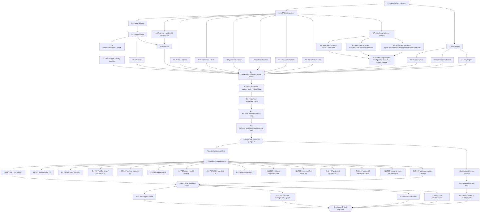

# Implementation Plan: telemetry-port

## Overview

This plan ports `@better-auth/telemetry` (vendored at
`upstream/better-auth/1.6.9/packages/telemetry/`) into the Ruby monorepo
as a canonical/alias gem pair (`better_auth-telemetry` +
`openauth-telemetry`) following the `better_auth-stripe` pattern.

The plan builds incrementally: skeleton → test seams → public surface →
detectors → `BetterAuth::Telemetry.create` orchestration → soft-load
integration into `BetterAuth::Auth` → alias gem → property-based tests
covering the 17 correctness properties → release-manifest /
`AGENTS.md` / README finalization.

Constraints honored throughout:

- No file under `upstream/better-auth/1.6.9/` is modified.
- No external HTTP gem is added; delivery uses `Net::HTTP` only.
- No HTTP mocking; tests use `RecordingTrack` (custom_track recorder)
  and `LocalEndpointServer` (TCPServer-backed recorder).
- All gemspec/Rakefile/test_helper/standardrb/Gemfile conventions
  mirror `packages/better_auth-stripe/`.
- Initial `BetterAuth::Telemetry::VERSION = "0.8.0"`.
- No other gem version is bumped.
- All Ruby code uses Minitest, with `prop_check` used when available
  (deterministic Minitest fallback otherwise).

## Task Dependency Graph (Mermaid)



## Tasks

- [x] 1. Bootstrap canonical `better_auth-telemetry` gem skeleton

  - [x] 1.1 Create canonical gem files (gemspec, Gemfile, Rakefile, .standard.yml, mirroring better_auth-stripe)
    - Create `packages/better_auth-telemetry/better_auth-telemetry.gemspec` with `spec.name = "better_auth-telemetry"`, `spec.required_ruby_version = ">= 3.2.0"`, `spec.add_dependency "better_auth", "~> 0.1"`, no external HTTP runtime dep, dev deps `bundler ~> 2.5`, `minitest ~> 5.25`, `rake ~> 13.2`, `standardrb ~> 1.0`. The gemspec MUST `require_relative "lib/better_auth/telemetry/version"` and use `BetterAuth::Telemetry::VERSION` for `spec.version`.
    - Create `packages/better_auth-telemetry/Gemfile` mirroring `packages/better_auth-stripe/Gemfile` (path-resolved `better_auth`, `gemspec name: "better_auth-telemetry"`, dev/test group with minitest/rake/standardrb).
    - Create `packages/better_auth-telemetry/Rakefile` identical in shape to `packages/better_auth-stripe/Rakefile` (`Rake::TestTask`, `task default: [:test, :standard]`).
    - Create `packages/better_auth-telemetry/.standard.yml` mirroring the stripe package.
    - Create empty `packages/better_auth-telemetry/CHANGELOG.md` with a `## 0.8.0` section header placeholder and a stub `packages/better_auth-telemetry/README.md` with the package title (final README content lands in task 11.1).
    - Symlink/copy `packages/better_auth-telemetry/LICENSE.md` from the repo root LICENSE if not already present (do not modify upstream license files).
    - _Implements: 1.1, 1.2, 1.6, 1.7, 1.8_
    - _Verify:_ `ls packages/better_auth-telemetry` shows gemspec/Gemfile/Rakefile/.standard.yml/README.md/CHANGELOG.md/LICENSE.md/lib/test; `bundle install` (no remote install) succeeds inside the package; `bundle exec rake -T` lists `test` and `standard`; `getDiagnostics` on the gemspec shows zero issues.

  - [x] 1.2 Define `BetterAuth::Telemetry::VERSION` constant
    - Create `packages/better_auth-telemetry/lib/better_auth/telemetry/version.rb` defining `module BetterAuth; module Telemetry; VERSION = "0.8.0"; end; end`.
    - _Implements: 1.3, 1.4_
    - _Verify:_ `ruby -Ilib -rbetter_auth/telemetry/version -e 'puts BetterAuth::Telemetry::VERSION'` from inside the package prints `0.8.0`; `getDiagnostics` reports zero issues.

  - [x] 1.3 Create `test/test_helper.rb` mirroring better_auth-stripe
    - Create `packages/better_auth-telemetry/test/test_helper.rb` requiring `minitest/autorun` and `better_auth/telemetry`. Also load `prop_check/minitest` only if `Gem.loaded_specs["prop_check"]` is non-nil so the suite degrades gracefully.
    - _Implements: 20.2, 20.8_
    - _Verify:_ `bundle exec rake test` runs (passes with zero tests for now); `getDiagnostics` reports zero issues.

- [x] 2. Test seams (no HTTP mocks)

  - [x] 2.1 Add `RecordingTrack` test support
    - Create `packages/better_auth-telemetry/test/telemetry/support/recording_track.rb` exposing a `Proc`-compatible recorder backed by a `Mutex`-protected `Array` of events. Expose `#events`, `#clear`, and `#last`. Ensure each `call` returns `nil` even if the array is full (no raises).
    - _Implements: 20.1, 20.3_
    - _Verify:_ Add a tiny minitest in `test/telemetry/support/recording_track_test.rb` that exercises `call`/`events`/`clear`; `bundle exec rake test` passes; `getDiagnostics` clean.

  - [x] 2.2 Add `LocalEndpointServer` test support
    - Create `packages/better_auth-telemetry/test/telemetry/support/local_endpoint_server.rb` that boots a `TCPServer` on an ephemeral port in a background thread, accepts a single HTTP `POST`, parses the body and headers into a `Struct` (`url`, `path`, `headers`, `body`), and shuts down on `#stop`. Provide `#url` returning `"http://127.0.0.1:<port>/telemetry"`. The 204 response after capture matches the upstream contract.
    - _Implements: 20.3, 5.3_
    - _Verify:_ Add `test/telemetry/support/local_endpoint_server_test.rb` that boots the server, posts via `Net::HTTP`, asserts headers/body captured, then `#stop`s; `bundle exec rake test` passes; no thread leakage on rerun.

  - [x] 2.3 Add `with_env` and `reset_project_id!` test helpers
    - Create `packages/better_auth-telemetry/test/telemetry/support/env_helpers.rb` providing `with_env(overrides) { ... }` (snapshots, mutates, restores `ENV`). Add a public-but-undocumented `BetterAuth::Telemetry.reset_project_id!` test hook in the same patch (placed inside the gem's `lib/better_auth/telemetry.rb` skeleton) so subsequent tests can reset the memoized id.
    - _Implements: 20.2, 14.6_
    - _Verify:_ Minitest in `test/telemetry/support/env_helpers_test.rb` confirms `ENV` is restored even when the block raises; `getDiagnostics` clean.

- [x] 3. Public surface foundations

  - [x] 3.1 Implement `NoopPublisher`
    - Create `packages/better_auth-telemetry/lib/better_auth/telemetry/noop_publisher.rb` defining `BetterAuth::Telemetry::NoopPublisher` with `#publish(_event) = nil` and `#enabled? = false`.
    - _Implements: 4.6, 5.1, 16.6_
    - _Verify:_ `test/telemetry/noop_publisher_test.rb` asserts `publish` returns `nil`, accepts any event hash, and `enabled?` is `false`; `bundle exec rake test` green.

  - [x] 3.2 Implement `LoggerAdapter`
    - Create `packages/better_auth-telemetry/lib/better_auth/telemetry/logger_adapter.rb`. Selection rule: prefer `logger.info`/`logger.error`; else `logger.call(level, msg)`; else `Kernel.warn`. Wrap every dispatch in `rescue StandardError; nil`. Add a class method `LoggerAdapter.from(options_logger)` that falls back to `BetterAuth::Logger.create` (or the existing default helper) when no logger is configured.
    - _Implements: 5.5, 21.1, 21.2, 21.3_
    - _Verify:_ `test/telemetry/logger_adapter_test.rb` exercises a logger that responds to `info/error`, a callable, a logger that raises, and the default fallback path; ensures none propagate.

  - [x] 3.3 Implement `NormalizedOptions` / `NormalizedContext` value objects
    - Create `packages/better_auth-telemetry/lib/better_auth/telemetry/options.rb` defining `NormalizedOptions.from(options)` and `NormalizedContext.from(context)`. Both accept either snake_case (`:custom_track`, `:skip_test_check`, `:database`, `:adapter`) or camelCase (`:customTrack`, `:skipTestCheck`) keys. Expose readers for `telemetry_enabled` (with `nil`/`true`/`false` precedence semantics), `telemetry_debug`, `base_url`, `app_name`, `logger` (wrapped via `LoggerAdapter.from`), `configuration` (the raw `BetterAuth::Configuration` when given, otherwise `nil`).
    - _Implements: 15.4, 4.1, 4.2, 4.3_
    - _Verify:_ `test/telemetry/options_test.rb` asserts both key shapes resolve identically; nil/missing keys produce nil readers; `getDiagnostics` clean.

  - [x] 3.4 Implement env wrapper + truthy classifier
    - Create `packages/better_auth-telemetry/lib/better_auth/telemetry/env.rb` that exposes `BetterAuth::Telemetry::Env.get(name)` (delegating to `BetterAuth::Env.get`) and `BetterAuth::Telemetry::Env.truthy?(value)` returning `true` iff the resolved string is non-empty AND not `"0"` AND `value.casecmp("false") != 0`.
    - _Implements: 3.1, 3.2, 3.3, 3.4, 3.5, 3.6, 3.7, 3.8_
    - _Verify:_ `test/telemetry/env_test.rb` covers `nil`, empty, `"0"`, `"false"`/`"FALSE"`, `"1"`, and verifies dual-prefix delegation by setting `OPEN_AUTH_TELEMETRY` vs `BETTER_AUTH_TELEMETRY`; `bundle exec rake test` green.

  - [x] 3.5 Implement `HttpClient.post_json`
    - Create `packages/better_auth-telemetry/lib/better_auth/telemetry/http_client.rb` defining `HttpClient.post_json(url, body, logger:)` which uses `Net::HTTP.start` with `open_timeout: 5`, `read_timeout: 5`, sets `Content-Type: application/json` and `User-Agent: better_auth-telemetry/<VERSION>`, encodes via `JSON.generate`, returns `nil`, and rescues every `StandardError` to log via `logger.error` (no re-raise).
    - _Implements: 1.8, 5.3, 5.6, 5.8_
    - _Verify:_ `test/telemetry/http_client_test.rb` boots `LocalEndpointServer`, posts a payload, asserts the captured body parses to the expected hash and contains the expected User-Agent header; a second test points at `http://127.0.0.1:1` (closed port) and asserts the call returns `nil` and the logger received an `error` line.

  - [x] 3.6 Implement `ProjectId` module + memoized `BetterAuth::Telemetry.project_id`
    - Create `packages/better_auth-telemetry/lib/better_auth/telemetry/project_id.rb`. Define `BetterAuth::Telemetry.project_id(base_url)` with a module-scoped memo guarded by a `Mutex`, plus the four-rule derivation chain (Base64 SHA-256 of `base_url + name`, of `name`, of `base_url`, otherwise random 32-char `[a-zA-Z0-9]` from `SecureRandom`). Define `ProjectId.resolve_project_name` with the precedence `app_name (≠ "Better Auth") → Bundler.locked_gems&.specs&.first&.name → File.basename(Bundler.root)`, all wrapped in `rescue StandardError; nil`. Expose `BetterAuth::Telemetry.reset_project_id!` for tests (already stubbed in 2.3 — wire it to the real cache here).
    - _Implements: 14.1, 14.2, 14.3, 14.4, 14.5, 14.6, 14.7, 14.8_
    - _Verify:_ `test/telemetry/project_id_test.rb` covers each of the four derivation cases (with `reset_project_id!` between them), asserts memoization across mixed `base_url` arguments, and confirms `Bundler` absence does not raise; `bundle exec rake test` green.

  - [x] 3.7 Implement `Publisher`
    - Create `packages/better_auth-telemetry/lib/better_auth/telemetry/publisher.rb`. Constructor takes `enabled:`, `anonymous_id:`, `track:`, `base_url:`, `logger:`. `#publish(event)` returns `nil` when not enabled, otherwise lazy-resolves `anonymous_id` via `BetterAuth::Telemetry.project_id(base_url)`, builds `{type:, payload:, anonymousId:}`, calls `track.call(event)`, and rescues any `StandardError` via `logger.error`. Accept both string and symbol `:type`/`:payload` keys on the input event.
    - _Implements: 5.6, 5.7, 6.10, 15.1, 15.2_
    - _Verify:_ `test/telemetry/publisher_test.rb` uses `RecordingTrack` to assert: disabled publisher is a noop; enabled publisher reuses the same `anonymousId` across multiple `publish` calls; raising `track` does not propagate but logs an error; both string/symbol input keys are normalized to symbol keys on the emitted event.

- [x] 4. Detectors

  - [x] 4.1 Implement `Detectors::Runtime`
    - Create `packages/better_auth-telemetry/lib/better_auth/telemetry/detectors/runtime.rb` returning `{name: "ruby", version: RUBY_VERSION, engine: defined?(RUBY_ENGINE) ? RUBY_ENGINE : "ruby"}`. No Node/Bun/Deno branches.
    - _Implements: 7.1, 7.2, 7.3, 7.4_
    - _Verify:_ `test/telemetry/detectors/runtime_test.rb` asserts the exact key set and the values match the constants on the host; `bundle exec rake test` green.

  - [x] 4.2 Implement `Detectors::Environment`
    - Create `packages/better_auth-telemetry/lib/better_auth/telemetry/detectors/environment.rb` returning `"production" | "ci" | "test" | "development"` with the precedence `production > ci > test > development`. CI marker list: `CI BUILD_ID BUILD_NUMBER CI_APP_ID CI_BUILD_ID CI_BUILD_NUMBER CI_NAME CONTINUOUS_INTEGRATION RUN_ID`. Test-env keys: `RACK_ENV RAILS_ENV APP_ENV`. Treat CI markers as set when non-empty and not (case-insensitive) `"false"`.
    - _Implements: 8.1, 8.2, 8.3, 8.4_
    - _Verify:_ `test/telemetry/detectors/environment_test.rb` uses `with_env` to drive each precedence case (production wins over ci, ci wins over test, test wins over default) and the explicit `"false"`/empty CI handling; `bundle exec rake test` green.

  - [x] 4.3 Implement `Detectors::SystemInfo`
    - Create `packages/better_auth-telemetry/lib/better_auth/telemetry/detectors/system_info.rb` with `safely { ... }` helper, the vendor table from the design (cloudflare/vercel/netlify/render/aws/gcp/azure/deno-deploy/fly-io/railway/heroku/digitalocean/koyeb), platform/release/architecture derivation from `RbConfig`/`Etc.uname`/`Gem::Platform.local`, `cpuCount` from `Etc.nprocessors`, `cpuModel: nil`, `memory` via `/proc/meminfo` (Linux) or `sysctl -n hw.memsize` (macOS) read with `IO.popen` + 1s timeout (rescue), `isWSL`/`isDocker` per Requirements 9.7/9.8, `isTTY` via `$stdout.tty?`. `cpuSpeed` is omitted from the returned hash.
    - _Implements: 9.1, 9.2, 9.3, 9.4, 9.5, 9.6, 9.7, 9.8, 9.9, 9.10, 9.11_
    - _Verify:_ `test/telemetry/detectors/system_info_test.rb` asserts the returned hash has every required key (cpuSpeed absent), that `with_env` simulating each vendor's marker variables produces the matching `deploymentVendor`, that injecting a probe that raises returns `nil` for that field instead of raising, and that `isTTY` reflects `$stdout.tty?`.

  - [x] 4.4 Implement `Detectors::Database`
    - Create `packages/better_auth-telemetry/lib/better_auth/telemetry/detectors/database.rb` with the precedence chain from Requirement 10: `context[:database]` override → `BetterAuth::Adapters::*` class → known adapter symbol → `Gem.loaded_specs` fallback in the order `sequel pg mysql2 sqlite3 activerecord mongoid mongo rom-sql` → `nil`. The whole call wrapped in `rescue StandardError; nil`.
    - _Implements: 10.1, 10.2, 10.3, 10.4_
    - _Verify:_ `test/telemetry/detectors/database_test.rb` covers each precedence branch using a stub `Configuration` and a stubbed `Gem.loaded_specs` (via `Gem.loaded_specs.stub` or by injecting a fake hash); `bundle exec rake test` green.

  - [x] 4.5 Implement `Detectors::Framework`
    - Create `packages/better_auth-telemetry/lib/better_auth/telemetry/detectors/framework.rb`. Inspect `Gem.loaded_specs` for `rails sinatra hanami hanami-router roda grape rack` in declaration order; first hit wins. No Node-only frameworks.
    - _Implements: 11.1, 11.2, 11.3, 11.4_
    - _Verify:_ `test/telemetry/detectors/framework_test.rb` stubs `Gem.loaded_specs` for several subsets, including the empty set (returns `nil`), and asserts the first-match wins across multiple loaded gems.

  - [x] 4.6 Implement `Detectors::ProjectInfo`
    - Create `packages/better_auth-telemetry/lib/better_auth/telemetry/detectors/project_info.rb` returning `{name: "bundler", version: ::Bundler::VERSION}` when `defined?(::Bundler)` and `Bundler.default_gemfile` succeeds, otherwise `nil`. Whole method wrapped in `rescue StandardError; nil`.
    - _Implements: 12.1, 12.2, 12.3_
    - _Verify:_ `test/telemetry/detectors/project_info_test.rb` covers Bundler-present and Bundler-absent (via `defined?` stubbing) cases; `bundle exec rake test` green.

  - [x] 4.7 Implement `Detectors::AuthConfig` skeleton + helpers
    - Create `packages/better_auth-telemetry/lib/better_auth/telemetry/detectors/auth_config.rb` with `bool(v)`/`raw(v)`/`bool_present(v)`/`count(arr)` helpers. Sketch the public `AuthConfig.call(options, context)` to read `BetterAuth::Configuration` or a raw options hash via a unified accessor (`fetch_path(opts, [:email_verification, :send_verification_email])` that handles symbol/string keys and the `Configuration` reader equivalent). Stub the redaction map sections to return `{}` for now (filled by 4.8/4.9/4.10).
    - _Implements: 13.1, 13.2, 13.9_
    - _Verify:_ `test/telemetry/detectors/auth_config_helpers_test.rb` exercises each helper across `nil`/empty/`""`/`"x"`/`true`/`false`/`0`; `getDiagnostics` clean; `bundle exec rake test` green.

  - [x] 4.8 Fill AuthConfig redaction map: emailVerification + emailAndPassword + hooks
    - Implement the redaction map rows from the design under `emailVerification.*`, `emailAndPassword.*` (including `password.{hash,verify}`), and `hooks.{before,after}`. Use `bool` for redacted callables, `raw` for scalar fields like `expiresIn`, `maxPasswordLength`, etc.
    - _Implements: 13.3, 13.4_
    - _Verify:_ `test/telemetry/detectors/auth_config_email_test.rb` builds a `BetterAuth::Configuration` with every listed leaf set to a sentinel string/value, asserts boolean redactions are exactly `true`/`false` and raw fields equal the input; asserts `JSON.generate(payload)` does not contain any sentinel string from the redacted set.

  - [x] 4.9 Fill AuthConfig redaction map: socialProviders + plugins + user + session + account + verification
    - Implement `socialProviders` as the array-of-hashes shape from the design (id, mapProfileToUser, disableDefaultScope, …), `plugins` as the `id` strings (or `nil` when empty), `user.*`/`verification.*`/`session.*`/`account.*` per the redaction map.
    - _Implements: 13.2, 13.4, 13.5, 13.6_
    - _Verify:_ `test/telemetry/detectors/auth_config_social_plugins_test.rb` uses two configured social providers and two plugin instances and asserts the array shapes, the `plugins == nil` empty-case, and the camelCase output keys.

  - [x] 4.10 Fill AuthConfig redaction map: advanced + trustedOrigins + rateLimit + onAPIError + logger + databaseHooks + secondaryStorage
    - Implement `advanced.*` (with `cookiePrefix`/cookies/cross-subdomain `domain`/cookie-attrs `domain` boolean-redacted, raw scalars preserved; emit upstream key `advanced.cookieAttributes` from `default_cookie_attributes`), `trustedOrigins` as the integer count, `rateLimit.*`, `onAPIError.*`, `logger.*`, `secondaryStorage` as `bool`, and every `databaseHooks.{user,session,account,verification}.{create,update}.{before,after}` leaf as `bool`.
    - _Implements: 13.3, 13.4, 13.7, 13.8_
    - _Verify:_ `test/telemetry/detectors/auth_config_advanced_test.rb` populates every redacted advanced/cookies/databaseHooks leaf with a sentinel string and asserts boolean output; counts trusted origins for an array of 3; checks `secret`, raw `cookiePrefix`, and `domain` strings are absent from `JSON.generate(payload)`.

  - [x] 4.11 AuthConfig: accept `BetterAuth::Configuration` or raw hash, apply context overrides
    - Wire `AuthConfig.call(options, context)` to handle both `BetterAuth::Configuration` and the raw hash shape. Inject `context[:database]` and `context[:adapter]` as `payload[:database]`/`payload[:adapter]` when present (raw pass-through; otherwise `nil`).
    - _Implements: 13.1, 13.9_
    - _Verify:_ `test/telemetry/detectors/auth_config_input_shape_test.rb` builds the same logical configuration via both `BetterAuth::Configuration.new(h)` and the raw hash `h`, calls `AuthConfig.call` on each, and asserts the two payloads are deep-equal; another case asserts context override values appear under `payload[:database]`/`payload[:adapter]`.

- [x] 5. `BetterAuth::Telemetry.create` orchestration

  - [x] 5.1 Create skeleton: normalize → noop short-circuit → `enabled?` decision
    - Create `packages/better_auth-telemetry/lib/better_auth/telemetry/create.rb` adding `BetterAuth::Telemetry.create(options, context = nil)`. Build `NormalizedOptions`/`NormalizedContext`, resolve `endpoint = Env.get("BETTER_AUTH_TELEMETRY_ENDPOINT")`, return `NoopPublisher.new` when both endpoint and `custom_track` are absent. Compute `enabled` per the decision table from Property 3, including the option-overrides-env precedence and the `RACK_ENV/RAILS_ENV/APP_ENV == "test"` skip with `skip_test_check` bypass.
    - _Implements: 4.1, 4.2, 4.3, 4.4, 4.5, 4.6, 4.7, 5.1, 15.1_
    - _Verify:_ `test/telemetry/create_decision_test.rb` covers the eight-cell decision table (options=nil/true/false × env=truthy/not × in_test=true/false × skip_test_check=true/false) and asserts each returns either a `NoopPublisher` or a `Publisher` with `enabled?` matching expectation.

  - [x] 5.2 Implement track lambda dispatcher (custom_track / debug / http)
    - Inside `create.rb`, build the `track` callable: if `context.custom_track` is present, call it (rescue `StandardError`, log error). Else if debug mode is on (`options.telemetry.debug == true` OR `Env.truthy?(Env.get("BETTER_AUTH_TELEMETRY_DEBUG"))`), call `logger.info(JSON.pretty_generate(event))` and skip HTTP. Else `HttpClient.post_json(endpoint, event, logger:)`.
    - _Implements: 5.2, 5.3, 5.4, 5.7, 5.9, 21.1, 21.2_
    - _Verify:_ `test/telemetry/create_dispatch_test.rb` covers all three dispatch paths: a `RecordingTrack` receives every event when injected; debug mode hits the logger and never the `LocalEndpointServer`; HTTP path hits the local server with the expected JSON.

  - [x] 5.3 Compose init payload and emit at create time
    - In `create.rb`, when enabled: lazy-resolve `anonymous_id = BetterAuth::Telemetry.project_id(base_url)`, call each detector wrapped in `safely`, build the init event `{type: "init", anonymousId:, payload: {config:, runtime:, database:, framework:, environment:, systemInfo:, packageManager:}}` with camelCase keys, fire it through the track lambda once, and return a fully-initialized `Publisher` whose subsequent `publish` calls reuse the same `track`/`anonymous_id`/`enabled` state.
    - _Implements: 6.1, 6.2, 6.3, 6.4, 6.5, 6.6, 6.7, 6.8, 6.9_
    - _Verify:_ `test/telemetry/create_init_event_test.rb` opts in via env, injects `RecordingTrack`, asserts exactly one event with `type: "init"`, the seven required payload keys, the `anonymousId` matches `BetterAuth::Telemetry.project_id(base_url)`, `runtime[:name] == "ruby"`, `environment ∈ {"production","ci","test","development"}`, and that `systemInfo` does not contain a `:cpuSpeed` key.

- [x] 6. Top-level entry points

  - [x] 6.1 Create `lib/better_auth/telemetry.rb` public entry
    - Create `packages/better_auth-telemetry/lib/better_auth/telemetry.rb` requiring `better_auth`, `digest/sha256`, `base64`, `json`, `net/http`, `securerandom`, `uri`, `mutex_m` (only if needed) and every internal file (`version`, `noop_publisher`, `logger_adapter`, `options`, `env`, `http_client`, `project_id`, `publisher`, `create`, every `detectors/*`). Confirm `BetterAuth::Telemetry` exposes `.create`, `.project_id`, `.reset_project_id!`, `Publisher`, `NoopPublisher`, `Detectors::*`.
    - _Implements: 1.5, 15.1, 15.2, 15.3_
    - _Verify:_ `test/telemetry/public_surface_test.rb` `require "better_auth/telemetry"` and asserts every documented constant is defined; `bundle exec rake test` green.

  - [x] 6.2 Create `lib/better_auth/plugins/telemetry.rb` shim
    - Create `packages/better_auth-telemetry/lib/better_auth/plugins/telemetry.rb` containing only `require "better_auth/telemetry"`. This is the file the core soft-load probe expects to find on the load path when the gem is bundled.
    - _Implements: 16.1, 16.2_
    - _Verify:_ `test/telemetry/plugins_shim_test.rb` requires the shim and asserts `BetterAuth::Telemetry.respond_to?(:create)`.

- [x] 7. Checkpoint A — canonical gem green
  - Run `bundle exec rake test` (and `bundle exec rake standard`) inside `packages/better_auth-telemetry/`. Ensure all tests pass and `getDiagnostics` reports zero issues across every file added so far. Ensure all tests pass, ask the user if questions arise.

- [x] 8. Soft-load integration into `BetterAuth::Auth`

  - [x] 8.1 Soft-load + `auth.telemetry` reader on `BetterAuth::Auth#initialize`
    - Modify `packages/better_auth/lib/better_auth/auth.rb`: add `:telemetry` to `attr_reader`, call `@telemetry = build_telemetry_publisher` at the end of `initialize`. Add private `build_telemetry_publisher` that does `require "better_auth/telemetry"` then `BetterAuth::Telemetry.create(@options, telemetry_context)`, rescues `LoadError` → noop, rescues `StandardError` → log + noop. Add private `telemetry_context` returning `{database: nil, adapter: @context.adapter.class.name, custom_track: nil, skip_test_check: false}`. Add a private noop publisher fallback class. Do NOT modify any other behavior in `Auth#initialize`. Do NOT add `better_auth/plugins/telemetry` to the soft-load `each` in `packages/better_auth/lib/better_auth.rb` (the gem ships its own shim outside core's `lib/`); the integration happens via the in-`Auth` `require`.
    - _Implements: 16.1, 16.2, 16.3, 16.4, 16.5, 16.6_
    - _Verify:_ `bundle exec rake test` inside `packages/better_auth/` still passes (no regression to existing core tests); `getDiagnostics` clean. Manual smoke: `BetterAuth.auth(secret: "x", database: :memory).telemetry.publish(type: "ping", payload: {})` returns `nil` without raising even when `better_auth-telemetry` is not bundled.

  - [x] 8.2 Soft-load integration test (gem-present + gem-absent)
    - Add `packages/better_auth-telemetry/test/telemetry/integration/auth_soft_load_test.rb` covering: (a) gem-present path — opt-in via env, inject `RecordingTrack` via a custom `BetterAuth::Auth` subclass that overrides `telemetry_context` to set `custom_track`, assert `auth.telemetry.publish` records; (b) gem-absent path — temporarily delete `BetterAuth::Telemetry` and force the `LoadError` branch by stubbing `Auth#build_telemetry_publisher` to call its real implementation under a `$LOAD_PATH` minus the telemetry gem path; assert `auth.telemetry.publish(...)` returns `nil` and does not raise.
    - _Implements: 16.1, 16.2, 16.5, 16.6_
    - _Verify:_ `bundle exec rake test` inside `packages/better_auth-telemetry/` green.

- [x] 9. Bootstrap `openauth-telemetry` alias gem

  - [x] 9.1 Create alias gem skeleton
    - Create `packages/openauth-telemetry/openauth-telemetry.gemspec` with `spec.name = "openauth-telemetry"`, `spec.version = "0.8.0"` (literal, NOT computed), the metadata block from `openauth-stripe.gemspec`, `spec.required_ruby_version = ">= 3.2.0"`, `spec.add_dependency "better_auth-telemetry", "0.8.0"` (literal pin). Create stub `packages/openauth-telemetry/README.md` (final content in 12.2) and `packages/openauth-telemetry/CHANGELOG.md` with a `## 0.8.0` placeholder.
    - _Implements: 2.1, 2.2, 2.3, 2.4, 2.7_
    - _Verify:_ `gem build openauth-telemetry.gemspec` inside the package succeeds; `getDiagnostics` reports zero issues.

  - [x] 9.2 Create `lib/openauth/telemetry.rb` shim
    - Create `packages/openauth-telemetry/lib/openauth/telemetry.rb` exactly mirroring `packages/openauth-stripe/lib/openauth/stripe.rb`: `require "openauth"`, `require "better_auth/telemetry"`, define `OpenAuth::Telemetry = BetterAuth::Telemetry unless const_defined?(:Telemetry, false)`, and call `alias_better_auth_constants!`.
    - _Implements: 2.5, 2.7_
    - _Verify:_ Add `packages/openauth-telemetry/test/openauth/telemetry_test.rb` (with a minimal `test_helper.rb`) asserting `OpenAuth::Telemetry == BetterAuth::Telemetry` and `OpenAuth::Telemetry.respond_to?(:create)`; run `bundle exec rake test` from the alias package; `getDiagnostics` clean.

- [x] 10. Property-based tests (17 properties, grouped into logical files)

  - [x] 10.1 PBT: env resolution + truthy classifier
    - Create `packages/better_auth-telemetry/test/telemetry/properties/env_property_test.rb`.
    - **Property 1: Environment variable resolution honors `OPEN_AUTH_*` precedence**
    - **Property 2: Truthy_Env_Value classification rule**
    - **Validates: Requirements 3.1, 3.5, 3.6, 3.7**

  - [x] 10.2 PBT: opt-in/skip-test decision table
    - Create `packages/better_auth-telemetry/test/telemetry/properties/decision_property_test.rb`.
    - **Property 3: Opt-in / test-skip / option-overrides-env decision table**
    - **Validates: Requirements 4.1, 4.2, 4.3, 4.4, 4.5, 4.6, 4.7**

  - [x] 10.3 PBT: init event top-level shape invariant
    - Create `packages/better_auth-telemetry/test/telemetry/properties/init_event_shape_property_test.rb`.
    - **Property 4: Init event top-level shape invariant**
    - **Validates: Requirements 6.1, 6.3, 6.4, 13.2**

  - [x] 10.4 PBT: AuthConfig leaf shape + invariance under input shape
    - Create `packages/better_auth-telemetry/test/telemetry/properties/auth_config_shape_property_test.rb`.
    - **Property 5: AuthConfig leaf shape conformance**
    - **Property 10: AuthConfig is invariant under input shape**
    - **Validates: Requirements 13.1, 13.5, 13.6, 13.7**

  - [x] 10.5 PBT: boolean redaction is non-leaking
    - Create `packages/better_auth-telemetry/test/telemetry/properties/redaction_property_test.rb`.
    - **Property 11: Boolean redaction is non-leaking**
    - **Validates: Requirements 13.3, 13.8**

  - [x] 10.6 PBT: raw fields preserved verbatim
    - Create `packages/better_auth-telemetry/test/telemetry/properties/raw_fields_property_test.rb`.
    - **Property 12: Raw fields are preserved verbatim**
    - **Validates: Requirements 13.4**

  - [x] 10.7 PBT: anonymousId reuse across publish calls
    - Create `packages/better_auth-telemetry/test/telemetry/properties/anonymous_id_property_test.rb`.
    - **Property 6: anonymousId reuse and project_id alignment**
    - **Validates: Requirements 6.2, 6.10**

  - [x] 10.8 PBT: JSON round-trip preserves event content
    - Create `packages/better_auth-telemetry/test/telemetry/properties/json_round_trip_property_test.rb`.
    - **Property 17: JSON round-trip preserves event content**
    - **Validates: Requirements 6.1, 6.3, 20.4**

  - [x] 10.9 PBT: environment classifier precedence
    - Create `packages/better_auth-telemetry/test/telemetry/properties/environment_classifier_property_test.rb`.
    - **Property 7: Environment classifier precedence**
    - **Validates: Requirements 8.1, 8.2, 8.3, 8.4, 20.7**

  - [x] 10.10 PBT: database detector precedence chain
    - Create `packages/better_auth-telemetry/test/telemetry/properties/database_detector_property_test.rb`.
    - **Property 8: Database detector precedence chain**
    - **Validates: Requirements 10.1, 10.2, 10.3, 10.4**

  - [x] 10.11 PBT: framework detector first-match-wins
    - Create `packages/better_auth-telemetry/test/telemetry/properties/framework_detector_property_test.rb`.
    - **Property 9: Framework detector first-match-wins**
    - **Validates: Requirements 11.1, 11.2, 11.3**

  - [x] 10.12 PBT: project_id derivation rules
    - Create `packages/better_auth-telemetry/test/telemetry/properties/project_id_derivation_property_test.rb`.
    - **Property 13: project_id derivation rules**
    - **Validates: Requirements 14.1, 14.2, 14.3, 14.4, 14.5**

  - [x] 10.13 PBT: project_id memoization / idempotence
    - Create `packages/better_auth-telemetry/test/telemetry/properties/project_id_idempotence_property_test.rb`.
    - **Property 14: project_id memoization / idempotence**
    - **Validates: Requirements 14.6, 20.6**

  - [x] 10.14 PBT: project_id name resolution precedence
    - Create `packages/better_auth-telemetry/test/telemetry/properties/project_id_name_resolution_property_test.rb`.
    - **Property 15: project_id name resolution precedence**
    - **Validates: Requirements 14.7, 14.8**

  - [x] 10.15 PBT: `auth.telemetry.publish` is exception-safe
    - Create `packages/better_auth-telemetry/test/telemetry/properties/publish_exception_safety_property_test.rb`.
    - **Property 16: `auth.telemetry.publish` is exception-safe**
    - **Validates: Requirements 5.6, 5.7, 16.6, 21.3**

- [x] 11. Checkpoint B — properties green
  - Run `bundle exec rake test` inside `packages/better_auth-telemetry/` and `packages/openauth-telemetry/`. Confirm every PBT file in task 10 runs at least 100 iterations under `prop_check` when available, and the deterministic Minitest fallback otherwise. Ensure all tests pass, ask the user if questions arise.

- [x] 12. Repository wiring (release manifest, AGENTS, READMEs)

  - [x] 12.1 Update `.release.yml`
    - Append `packages/better_auth-telemetry/lib/better_auth/telemetry/version.rb` to `version_files`. Append `packages/openauth-telemetry/openauth-telemetry.gemspec` to `literal_gemspec_versions`. Add a new key `packages/openauth-telemetry/openauth-telemetry.gemspec:` under `pinned_dependencies` with the single list entry `- better_auth-telemetry`. Do NOT modify the top-level `version: "0.8.0"` line. Do NOT remove any existing entry.
    - _Implements: 17.1, 17.2, 17.3, 17.4, 19.3_
    - _Verify:_ `cat .release.yml` shows the three new lines in the documented sections; running the existing release-tooling lint (or `ruby -ryaml -e 'YAML.load_file(".release.yml")'`) returns without error.

  - [x] 12.2 Update root `AGENTS.md` Packages table
    - In `AGENTS.md`, insert one new row in the Packages table, after the `packages/better_auth-stripe` row and before `packages/better_auth-redis-storage`: `| `packages/better_auth-telemetry` | Canonical telemetry gem. Opt-in usage analytics, port of `@better-auth/telemetry`. |`. The existing `packages/openauth*` row already covers the alias gem (Requirement 18.2 is satisfied by that generic row).
    - _Implements: 18.1, 18.2, 18.3_
    - _Verify:_ `grep "better_auth-telemetry" AGENTS.md` shows the new row in the right block; `getDiagnostics` clean.

  - [x] 12.3 Write canonical `better_auth-telemetry/README.md`
    - Replace the stub created in 1.1 with the full README: title, install snippet (`gem "better_auth-telemetry"` + `require "better_auth/telemetry"`), opt-in env vars listed for both `BETTER_AUTH_*` and `OPEN_AUTH_*` prefixes (`BETTER_AUTH_TELEMETRY`, `BETTER_AUTH_TELEMETRY_DEBUG`, `BETTER_AUTH_TELEMETRY_ENDPOINT`), opt-in via `options[:telemetry][:enabled] = true`, debug mode behavior, the `custom_track` injection seam (with a code example using a `Proc`), the test-environment skip + `skip_test_check` bypass, and the "Differences from upstream" section listing every Ruby-specific deviation from the design (single Ruby implementation; `runtime.engine` extra key; `cpuSpeed` omitted; `cpuModel` always `nil`; `packageManager` reflects Bundler not npm; framework/database probe lists; std-lib only HTTP; snake_case canonical context keys with camelCase synonyms accepted; `appName` not emitted; the public `BetterAuth::Telemetry.reset_project_id!` testing helper).
    - _Implements: 1.9, 9.8 (cpuSpeed deviation), 12.3, 16.6_
    - _Verify:_ `grep -E "BETTER_AUTH_TELEMETRY|OPEN_AUTH_TELEMETRY|custom_track|reset_project_id|cpuSpeed|cpuModel" packages/better_auth-telemetry/README.md` returns each phrase at least once; `getDiagnostics` clean.

  - [x] 12.4 Write `openauth-telemetry/README.md`
    - Replace the stub created in 9.1 with the alias README mirroring `packages/openauth-stripe/README.md`: title `openauth-telemetry`, install (`gem "openauth-telemetry"` + `require "openauth/telemetry"`), one paragraph stating the package depends on `better_auth-telemetry` and re-exports its public surface, link to the docs site, no telemetry logic of its own.
    - _Implements: 2.6, 2.7_
    - _Verify:_ `diff -u packages/openauth-stripe/README.md packages/openauth-telemetry/README.md` shows only telemetry-vs-stripe wording differences (same structure); `getDiagnostics` clean.

  - [x] 12.5 Populate canonical `CHANGELOG.md`
    - Replace the placeholder created in 1.1 with a proper `## 0.8.0` entry summarizing: initial release; ports `@better-auth/telemetry`; opt-in only; supports both `BETTER_AUTH_*` and `OPEN_AUTH_*` env prefixes; std-lib HTTP; no upstream files modified.
    - _Implements: 1.9_
    - _Verify:_ `head -20 packages/better_auth-telemetry/CHANGELOG.md` shows the new entry; `getDiagnostics` clean.

- [x] 13. Final checkpoint — full repo verification
  - Run `bundle exec rake test` and `bundle exec rake standard` inside both `packages/better_auth-telemetry/` and `packages/openauth-telemetry/`. Run `bundle exec rake test` inside `packages/better_auth/` to confirm the soft-load integration in 8.1 did not regress core. Run `getDiagnostics` across every file added or modified in this plan and confirm zero issues. Confirm `git status` lists no changes under `upstream/better-auth/1.6.9/`. Ensure all tests pass, ask the user if questions arise.

## Notes

- Tasks marked with `*` are optional property-based tests. They can be
  skipped for a faster MVP, but Requirement 20.4–20.8 expects them in a
  shipping release; the canonical implementation tasks (1.x–9.x, 12.x)
  are NOT marked optional.
- Each property-based test under task 10 uses `prop_check` when the gem
  is loadable and falls back to deterministic Minitest cases (fixed
  `SecureRandom` seed, ≥ 100 iterations) otherwise, per Requirement
  20.8 and the design's testing-strategy section.
- HTTP delivery is verified end-to-end by `LocalEndpointServer` (real
  `TCPServer`) instead of mocks, satisfying Requirement 20.3 and the
  AGENTS.md "Avoid mocks unless the real dependency is impractical"
  rule.
- Every detector probe is wrapped in `rescue StandardError; nil` so
  partial host-probe failures degrade individual fields to `nil`
  rather than aborting `Auth#initialize` (Requirement 9.11).
- The soft-load integration in 8.1 keeps `BetterAuth::Auth#initialize`
  working unchanged when `better_auth-telemetry` is not bundled
  (Requirement 16.2): `LoadError` and any `StandardError` thrown from
  `BetterAuth::Telemetry.create` are rescued and the reader returns a
  noop publisher.
- No file under `upstream/better-auth/1.6.9/` is touched at any point
  in this plan (Requirement 19.1, 19.2). Release coverage for the new
  packages is achieved purely by appending to `.release.yml`
  (Requirement 19.3).
- Task numbering uses two-level decimal notation only (no deeper
  nesting). Top-level tasks (1, 2, …) are epics; decimal sub-tasks
  (1.1, 1.2, …) are the leaves that carry both implementation work and
  the colocated `_Verify:_` step that confirms each leaf is complete
  before the next dependent leaf begins.

## Workflow Completion

This workflow produced the design and planning artifacts. Implementation
has not started. To begin executing tasks, open this `tasks.md` file and
click "Start task" next to any task item, starting with **1.1**.

## Task Dependency Graph

```json
{
  "waves": [
    { "id": 0, "tasks": ["1.1"] },
    { "id": 1, "tasks": ["1.2", "1.3"] },
    { "id": 2, "tasks": ["2.1", "2.2", "2.3", "3.1", "4.1", "4.2", "4.3", "4.4", "4.5", "4.6", "4.7", "3.6"] },
    { "id": 3, "tasks": ["3.2", "4.8", "4.9", "4.10"] },
    { "id": 4, "tasks": ["3.3", "3.5", "4.11"] },
    { "id": 5, "tasks": ["3.4", "3.7"] },
    { "id": 6, "tasks": ["5.1"] },
    { "id": 7, "tasks": ["5.2"] },
    { "id": 8, "tasks": ["5.3"] },
    { "id": 9, "tasks": ["6.1"] },
    { "id": 10, "tasks": ["6.2"] },
    { "id": 11, "tasks": ["8.1", "9.1"] },
    { "id": 12, "tasks": ["8.2", "9.2"] },
    { "id": 13, "tasks": ["10.1", "10.2", "10.3", "10.4", "10.5", "10.6", "10.7", "10.8", "10.9", "10.10", "10.11", "10.12", "10.13", "10.14", "10.15", "12.1", "12.2", "12.4"] },
    { "id": 14, "tasks": ["12.3", "12.5"] }
  ]
}
```
